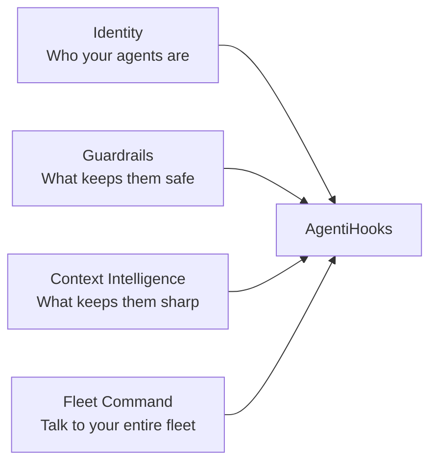
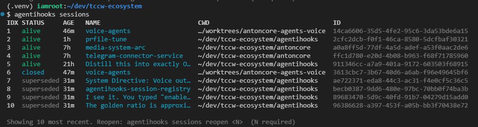

# agentihooks

[](https://the-cloud-clock-work.github.io/agentihooks/)
[](https://github.com/The-Cloud-Clock-Work/agentihooks/blob/main/LICENSE)
[](https://github.com/The-Cloud-Clock-Work/agentihooks/actions/workflows/ci.yml)
[](https://python.org)
[](https://the-cloud-clock-work.github.io/agentihooks/)

The production harness for [Claude Code](https://docs.anthropic.com/en/docs/claude-code). Turn Claude Code into a managed fleet — with smart profiles that shift mid-session, guardrails, context intelligence, and real-time broadcast messaging across every active session.

> **Full documentation:** [the-cloud-clock-work.github.io/agentihooks](https://the-cloud-clock-work.github.io/agentihooks/)

---

## The Four Pillars



### Pillar 1: Identity — *Who your agents are*

One command transforms your agent's entire personality, permissions, and toolset.

```bash
agentihooks init --profile coding,anton     # chain profiles
agentihooks settings-profile admin          # swap permissions without touching persona
agentihooks init --local --profile infra    # per-repo identity
```

- **Profile chaining** — comma-separated profiles merge left-to-right (rules accumulate, settings deep-merge, CLAUDE.md concatenates)
- **Two-axis model** — persona (rules/CLAUDE.md) and settings (permissions/MCP) are independent layers
- **Bundle system** — external repos of profiles, auto-discovered via `agentihooks bundle link`
- **Built-in profiles:** `default` (auto mode), `coding` (acceptEdits), `admin` (bypassPermissions)
- **Live rule refresh** — `agentihooks refresh-rules` pushes rule updates into every running Claude session without restart. One-shot per session, session-snapshotted so new sessions don't re-consume.

[Full docs: Identity](https://the-cloud-clock-work.github.io/agentihooks/docs/pillars/identity/)

### Pillar 2: Guardrails — *What keeps them safe*

8+ guardrails active by default. Your fleet operates within boundaries you set.

| Guardrail | What it does |
|-----------|-------------|
| **Secrets — two-tier** | Hard-block on Write/Edit/Bash-to-file containing secrets; inline Bash args scan + log + note only (operator-managed transcript) |
| **Branch + PR guard** | Default-deny branch creation and `gh pr create`; unlocked per-turn (branch) or per-session (PR) by operator signal phrases |
| **Prod lockdown** | Default-deny `gh pr merge main`, `release.yml`, `:latest`/`:prod`/`:stable` image tags; session-scoped unlock via release/hotfix signals |
| **Retry breaker** | Soft directive at N=5 (launch error-researcher agents) → hard block at N=10 on repeated identical failures |
| **Dependency banner** | Visible banner on every pip/npm/cargo/uv/poetry/apt/brew install — supply chain audit surface |
| **Version guard** | Blocks AI from editing version fields in manifests |
| **CLAUDE.md sanity** | Prevents bloat past configurable line limit |
| **MCP surface area** | Warns when too many tools are loaded |
| **Bash output filter** | Truncates verbose output to save tokens |
| **File read dedup** | Blocks redundant re-reads of unchanged files |

[Full docs: Guardrails](https://the-cloud-clock-work.github.io/agentihooks/docs/pillars/guardrails/)

### Pillar 3: Context Intelligence — *What keeps them sharp*

LLMs lose focus on early instructions as conversations grow. AgentiHooks defeats attention decay.

- **Context refresh** — re-injects rules every 20 turns and CLAUDE.md every 40 turns
- **Priority frontmatter** — critical rules load first within the 8000-char budget
- **Token compression** — 4 levels (off/light/standard/aggressive) with safety-preserving protection mask
- **Tool memory** — past errors injected so agents don't repeat mistakes
- **Brain adapter** — pluggable source that pumps knowledge (hot arcs, operational memory) into agents via broadcast channels
- **Context audit** — tracks what's being injected and how much budget is used

```bash
# In ~/.agentihooks/.env
CONTEXT_REFRESH_COMPRESSION=standard    # default
CONTEXT_COMPRESSION_SCOPE=all           # compress all injections
```

[Full docs: Context Intelligence](https://the-cloud-clock-work.github.io/agentihooks/docs/pillars/context/)

### Pillar 4: Fleet Command — *Talk to your entire fleet*

> **No other tool does this.** Send messages to every active Claude Code session simultaneously — like a PA system for your AI workforce. Now with **channels** for targeted delivery — subscribe agents to topics, and only the right sessions hear the right messages.

```bash
# Manual — full control
agentihooks broadcast "Deploy freeze until 3am" -s alert -t 8h
agentihooks broadcast "STOP ALL WRITES" -s critical -t 15m

# AI-assisted — describe intent in plain English
agentihooks broadcast emit "production incident, all agents stop deploying"
agentihooks broadcast emit "clear all broadcasts"
```

| Severity | Delivery | Default TTL | Use case |
|----------|----------|-------------|----------|
| `info` | Once per session | 4 hours | Reminders, FYI notices |
| `alert` | Every user turn | 1 hour | Deploy freezes, degraded services |
| `critical` | Every turn + every tool call | 30 min | Incidents, immediate stops |

`emit` is sandboxed: Claude Haiku can **only** run `agentihooks broadcast` commands — all other tools are disallowed.

[Full docs: Fleet Command](https://the-cloud-clock-work.github.io/agentihooks/docs/pillars/fleet-command/)

---

## Quick Start

**Requirement:** [uv](https://docs.astral.sh/uv/getting-started/installation/) must be installed.

```bash
git clone https://github.com/The-Cloud-Clock-Work/agentihooks
cd agentihooks

# 1. Create the dedicated venv and install everything
uv venv ~/.agentihooks/.venv
uv pip install --python ~/.agentihooks/.venv/bin/python -e ".[all]"

# 2. Install hooks + settings + MCP into ~/.claude
agentihooks init
```

`agentihooks init` wires hooks into `~/.claude/settings.json`, symlinks skills/agents/commands/rules, merges MCP servers into `~/.claude.json`, installs the CLI globally, and starts the sync daemon. Re-run any time — it is idempotent.

## A CLI that keeps up with your fleet

`agentihooks sessions` shows every running Claude Code session at a glance — session names from `/rename`, accurate lifetimes, and reopen by index for crash recovery.



## Architecture

```
Claude Code
  |
  |-- Hook Events (stdin JSON) --> python -m hooks --> hook_manager.py
  |     SessionStart, PreToolUse,       |
  |     PostToolUse, Stop, ...         |-- context refresh + compression
  |     (10 events total)              |-- guardrails pipeline
  |                                    |-- broadcast delivery
  |                                    |-- transcript logging
  |
  |-- statusLine (native setting) --> python -m hooks.statusline
  |     pipes JSON on every turn       --> 2-3 line status bar
  |
  +-- MCP Tools --> python -m hooks.mcp --> category modules
        aws, email, messaging,               --> hooks/integrations/*
        database, compute, ...
```

## CLI Reference

```bash
# Install / configure
agentihooks init                             # global install with default profile
agentihooks init --profile coding,anton       # chain profiles
agentihooks init --local --profile infra     # per-repo config
agentihooks settings-profile admin           # quick-switch settings layer

# Fleet messaging
agentihooks broadcast "msg"                  # send info broadcast
agentihooks broadcast "msg" -s critical      # critical severity
agentihooks broadcast emit "natural lang"    # AI-assisted
agentihooks broadcast --list                 # active broadcasts
agentihooks broadcast --clear                # clear all

# Launch claude with profile flags
agentihooks claude                           # reads profile.yml -> CLI flags
agenti                                       # alias (after source ~/.bashrc)

# Bundle management
agentihooks bundle link ~/dev/my-tools       # link a bundle
agentihooks bundle pull                      # update linked bundle

# Runtime overlays (mid-session profile shifting)
agentihooks overlay list                     # available overlays for current base
agentihooks overlay add patch-mode           # activate overlay
agentihooks overlay remove patch-mode        # deactivate overlay
agentihooks overlay clear                    # remove all overlays

# Broadcast channels (targeted messaging)
agentihooks channel publish brain "msg"      # publish to a channel
agentihooks channel list                     # active channels + message counts
agentihooks channel subscribe brain          # subscribe CWD project
agentihooks channel unsubscribe brain        # unsubscribe CWD project

# Brain adapter (knowledge injection)
agentihooks brain status                     # source type, entries, refresh state
agentihooks brain refresh                    # force re-read + republish

# Live rule refresh (push rule updates into running sessions)
agentihooks refresh-rules --dry-run          # preview payload + target session IDs
agentihooks refresh-rules                    # one-shot push to all alive sessions
agentihooks refresh-rules --clear            # cancel a pending marker

# Session registry (crash recovery + session picker)
agentihooks sessions                         # list recent sessions with NAME + AGE columns
agentihooks sessions reopen <IDX>            # reopen by index from the list
agentihooks sessions backfill                # seed registry from JSONL transcripts

# Diagnostics
agentihooks status                           # full system health
agentihooks lint-claude [path]               # CLAUDE.md token cost analysis
agentihooks mcp report                       # MCP surface area

# Daemon
agentihooks daemon start|stop|status|logs    # sync daemon

# Utilities
agentihooks ignore [path]                    # create .claudeignore
agentihooks --list-profiles                  # available profiles
agentihooks --query                          # active profile name
agentihooks uninstall [--yes]                # remove everything
```

## What `init` Does

1. Links bundle (if `--bundle` provided)
2. Merges settings: `settings.base.json` -> profile overrides -> settings-profile overlay -> OTEL config
3. Symlinks skills, agents, commands, and rules (3-layer merge, additive across chain)
4. Writes `CLAUDE.md` to `~/.claude/CLAUDE.md`
5. Installs MCP servers (hooks-utils + bundle + profile)
6. Applies hierarchy-aware MCP blacklist to all registered projects
7. Prunes orphaned MCP servers
8. Installs CLI globally via `uv tool`
9. Restarts sync daemon
10. Writes bashrc block (`agentienv` shell function + `agenti` alias)

## Profiles

Profiles mirror the Claude Code project structure:

```
profiles/<name>/
|-- CLAUDE.md                    # system prompt (-> ~/.claude/CLAUDE.md)
|-- profile.yml                  # agentihooks metadata + claude flags
+-- .claude/
    |-- settings.overrides.json  # merged into ~/.claude/settings.json
    |-- .mcp.json                # profile MCP servers
    |-- skills/                  # -> ~/.claude/skills/
    |-- agents/                  # -> ~/.claude/agents/
    |-- commands/                # -> ~/.claude/commands/
    +-- rules/                   # -> ~/.claude/rules/
```

Built-in profiles: `default` (auto), `coding` (acceptEdits), `admin` (bypassPermissions). Bundle profiles are discovered automatically.

**3-layer merge:** agentihooks built-in -> bundle global `.claude/` -> profile-specific `.claude/`. Applies to skills, agents, commands, rules, and MCP servers.

**Profile chaining:** `agentihooks init --profile coding,anton` applies each profile sequentially — hooks append, CLAUDE.md concatenates, rules/skills accumulate additively.

**Runtime overlays — profiles that shift mid-session:**

Your agent is running on `anton`. A service breaks. Instead of restarting:

```
agent calls → overlay_add("patch-mode")
```

Next turn, the agent has `patch-mode` rules layered on top — surgical mode, investigation-first, operator-gated commits. It fixes the service, operator validates, then:

```
agent calls → overlay_remove("patch-mode")
```

Back to `anton`. Full autonomy. Image rebuild in parallel. Zero session restart, zero context loss. The base profile's `allowedOverlays` field controls which overlays agents can activate — no escalation to profiles they weren't designed for.

This is a **smart profile system** — agents don't just have identities, they shift between complementary modes like a musician moving between tension and release. [Full docs: Runtime Overlays](https://the-cloud-clock-work.github.io/agentihooks/docs/pillars/overlays/)

**Settings profiles (two-axis model):** Control settings independently from persona:

```bash
agentihooks init --profile anton --settings-profile admin
agentihooks settings-profile admin           # quick-switch
agentihooks settings-profile --clear         # revert
```

## Hook Events

10 lifecycle events, all handled by `python -m hooks`:

| Event | Key behavior |
|-------|-------------|
| `SessionStart` | Register session, inject context, brain injection, deliver broadcasts, MCP warnings |
| `PreToolUse` | Secrets scan, branch/version guard, retry breaker, critical broadcasts |
| `PostToolUse` | Bash output filtering, file dedup, tool error recording |
| `UserPromptSubmit` | Secrets scan, overlay injection, brain refresh, context refresh, channel-filtered broadcast delivery |
| `Stop` | Transcript scan, auto-memory, cost metrics |
| `SessionEnd` | Deregister session, clear caches, log summary |
| `SubagentStop` | Subagent transcript logging |
| `Notification` | Log notifications |
| `PreCompact` | Log before compaction |
| `PermissionRequest` | Log permission requests |

## Configuration

All configuration in `.env` files in `~/.agentihooks/`. Key variables:

| Variable | Default | Description |
|----------|---------|-------------|
| `CONTEXT_REFRESH_COMPRESSION` | `standard` | Token compression level |
| `CONTEXT_COMPRESSION_SCOPE` | `refresh` | Scope: `refresh` or `all` |
| `CONTEXT_REFRESH_INTERVAL` | `20` | Re-inject rules every N turns |
| `BROADCAST_ENABLED` | `true` | Fleet messaging master switch |
| `BROADCAST_CRITICAL_ON_PRETOOL` | `true` | Critical alerts on every tool call |
| `TOKEN_CONTROL_ENABLED` | `true` | Token control layer master switch |
| `BASH_FILTER_ENABLED` | `true` | Truncate verbose bash output |
| `FILE_READ_CACHE_ENABLED` | `true` | Block redundant file re-reads |
| `OVERLAY_INJECTION_ENABLED` | `true` | Mid-session overlay profile injection |
| `IMAGE_PERSISTENCE_REMINDER_ENABLED` | `true` | Remind to rebuild images after live patches |
| `BRAIN_ENABLED` | `false` | Brain adapter master switch |
| `BRAIN_SOURCE_PATH` | `~/.agentihooks/brain` | Directory to read brain content from |
| `BRAIN_CHANNEL` | `brain` | Broadcast channel for brain content |
| `BRAIN_REFRESH_INTERVAL` | `30` | Re-read brain source every N turns |

Complete table: [Configuration Reference](https://the-cloud-clock-work.github.io/agentihooks/docs/reference/configuration/)

## Per-Repo Config

```bash
agentihooks init --local                     # per-repo config for current directory
agentihooks init --local --profile coding    # override profile for this project
```

Reads `.agentihooks.json` from repo root and generates `.claude/settings.local.json` + `.claude/CLAUDE.local.md`.

## Portability

Everything user-specific lives in `~/.agentihooks/`. To move to a new machine:

```bash
uv venv ~/.agentihooks/.venv
uv pip install --python ~/.agentihooks/.venv/bin/python -e ".[all]"
agentihooks init
```

## Related Projects

| Project | Description |
|---------|-------------|
| [agenticore](https://github.com/The-Cloud-Clock-Work/agenticore) | Claude Code runner and orchestrator |
| [agentibridge](https://github.com/The-Cloud-Clock-Work/agentibridge) | MCP server for session persistence and remote control |

## License

See [LICENSE](LICENSE) for details.
