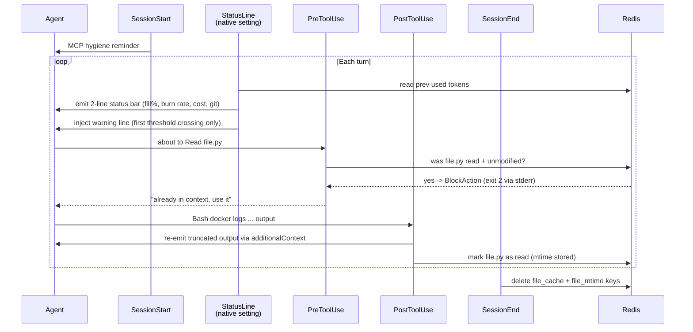
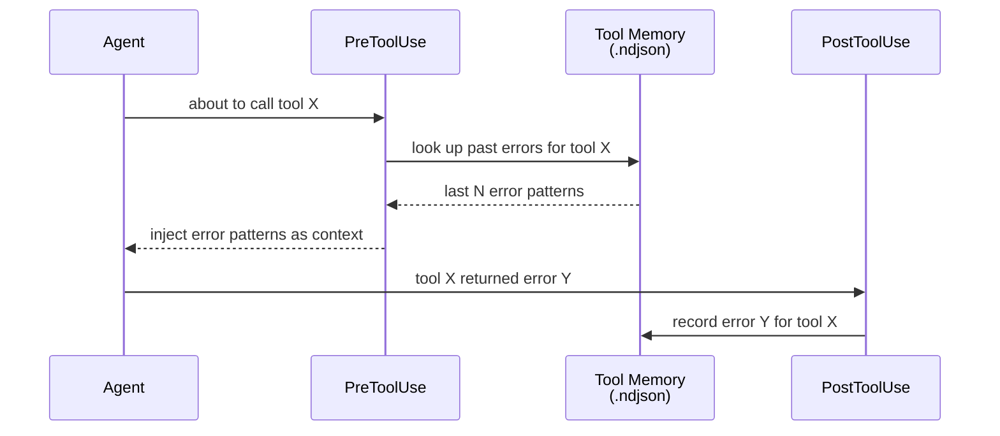

# Hook Events
{: .no_toc }

AgentiHooks registers handlers for all 10 Claude Code hook events. **StatusLine** is not a hook event -- it is a native Claude Code setting (`"statusLine"` key in `settings.json`) handled by a separate script (`hooks/statusline.py`).

## Table of contents
{: .no_toc .text-delta }

1. TOC
{:toc}

---

## Exit code semantics

| Exit code | Meaning |
|-----------|---------|
| `0` | Allow -- Claude Code proceeds normally |
| `2` | Block -- Claude Code cancels the action and displays the hook's **stderr** as a warning |

> **Note:** `BlockAction` exceptions print to **stderr** (not stdout). This ensures Claude Code displays the block reason cleanly rather than showing "No stderr output".

---

## SessionStart

**When:** A new Claude Code session begins.

**Payload fields:**

| Field | Type | Description |
|-------|------|-------------|
| `session_id` | string | Unique session identifier |

**Handler actions:**

1. Creates `/tmp/<session_id>/` as the session working directory
2. Injects a context message into Claude's context window with session awareness
3. Logs output token limit awareness if `CLAUDE_CODE_MAX_OUTPUT_TOKENS` is set
4. If `MCP_HYGIENE_ENABLED=true`: injects a reminder to disable unused MCP servers via `/mcp` to reduce per-turn token overhead

---

## SessionEnd

**When:** The session ends normally (not via Stop).

**Payload fields:**

| Field | Type | Description |
|-------|------|-------------|
| `session_id` | string | Session identifier |
| `transcript_path` | string | Path to the session transcript JSONL file |

**Handler actions:**

1. Parses the transcript to extract metrics (`num_turns`, `duration_ms`)
2. Logs all transcript entries to the hooks log
3. If `FILE_READ_CACHE_ENABLED=true`: clears the file read cache for this session from Redis
4. Cleans up the `/tmp/<session_id>/` directory

---

## UserPromptSubmit

**When:** The user submits a prompt (before Claude processes it).

**Payload fields:**

| Field | Type | Description |
|-------|------|-------------|
| `session_id` | string | Session identifier |
| `prompt` | string | The user's raw prompt text |

**Handler actions:**

1. Scans the prompt for secrets and credentials using regex patterns
2. If secrets are detected: injects a warning into the context (does **not** block -- warnings only at this stage)

---

## PreToolUse

**When:** Before any tool executes. This is the primary security gate.

**Payload fields:**

| Field | Type | Description |
|-------|------|-------------|
| `session_id` | string | Session identifier |
| `tool_name` | string | Name of the tool about to run |
| `tool_input` | object | Tool input parameters |
| `transcript_path` | string | Path to transcript |

**Handler actions:**

1. Logs the transcript entry
2. **Secret scanning** -- scans `tool_input` for credentials; exits with code `2` (block) if found
3. **File read deduplication** -- if `FILE_READ_CACHE_ENABLED=true` and `tool_name == "Read"`: checks whether the file was already read this session and is unmodified (by mtime). If so, exits with code `2` and tells Claude to use the content already in context
4. **CLAUDE.md sanity check** -- if `AGENTIHOOKS_CLAUDE_MD_SANITY_CHECK=true` (default) and `tool_name` is `Write` or `Edit` targeting a `CLAUDE.md` or `CLAUDE.local.md` file: simulates the resulting file and exits with code `2` if it would exceed `AGENTIHOOKS_CLAUDE_MD_MAXLINES` (default `200`). Prevents agents from bloating critical config files
5. **Tool memory injection** -- looks up past errors for this tool and injects them as context so the agent can avoid repeating mistakes

**Exit codes used:**

- `0` -- tool is safe to run
- `2` -- secret detected **or** redundant file read blocked; action blocked with explanation

---

## PostToolUse

**When:** After a tool completes (success or failure).

**Payload fields:**

| Field | Type | Description |
|-------|------|-------------|
| `session_id` | string | Session identifier |
| `tool_name` | string | Name of the tool that ran |
| `transcript_path` | string | Path to transcript |
| `tool_output` | string | Tool's stdout |
| `tool_error` | string | Tool's stderr (empty on success) |

**Handler actions:**

1. Logs the transcript entry
2. If `BASH_FILTER_ENABLED=true` and `tool_name == "Bash"`: detects verbose output categories (docker logs, kubectl, git log, test runners, build tools) and truncates to configured limits before it accumulates in the context window. Filtered output is re-emitted via `additionalContext` so Claude still sees the relevant portion
3. If `FILE_READ_CACHE_ENABLED=true` and `tool_name == "Read"`: records the file path and its current mtime in the session cache (Redis or memory) so future re-reads can be detected
4. If `tool_error` is non-empty: records the error pattern to the tool memory file (`~/.agenticore_tool_memory.ndjson`) for future injection

---

## Stop

**When:** The agent stops (task complete or unrecoverable error). This is the most active handler.

**Payload fields:**

| Field | Type | Description |
|-------|------|-------------|
| `session_id` | string | Session identifier |
| `transcript_path` | string | Path to transcript |

**Handler actions:**

1. Parses transcript to extract metrics (`num_turns`, `duration_ms`)
2. Scans transcript for MCP errors that `PostToolUse` may have missed
3. If errors found and email is configured (`SMTP_SERVER`): sends an error notification email
4. Logs all transcript entries
5. If `MEMORY_AUTO_SAVE=true`: saves a session digest to the memory store

---

## SubagentStop

**When:** A subagent (spawned agent) stops.

**Payload fields:**

| Field | Type | Description |
|-------|------|-------------|
| `session_id` | string | Subagent's session identifier |
| `transcript_path` | string | Path to subagent transcript |

**Handler actions:**

1. Logs the subagent's transcript entries to the hooks log

---

## StatusLine (native setting, not a hook event)

**StatusLine is not a hook event.** It is configured as a native Claude Code setting in `settings.json`:

```json
"statusLine": {
  "type": "command",
  "command": "cd /app && python3 -m hooks.statusline"
}
```

Claude Code pipes a JSON payload to `hooks/statusline.py` on every turn. The script reads the payload and prints 2-3 lines to stdout that appear in the terminal status bar.

**Payload fields:**

| Field | Type | Description |
|-------|------|-------------|
| `session_id` | string | Session identifier |
| `context_window` | object | `{context_window_size, total_input_tokens, used_percentage, current_usage, ...}` |
| `model` | object | `{display_name, ...}` -- active model |
| `cost` | object | `{total_cost_usd, total_duration_ms, total_api_duration_ms, total_lines_added, total_lines_removed}` |
| `worktree` | object | Active worktree info (name, path) -- if in a worktree |
| `vim` | object | Vim mode info (`{mode}`) -- if vim keybindings are active |

**Output (printed to stdout):**

Line 1 -- context fill bar, model, cost, duration:
```
########## 54% | claude-sonnet-4-6 | $0.0231 | 12s
```

Line 2 -- token counts, burn rate, lines changed, cache ratio, git branch:
```
ctx: 540K/1M | burn: 23K/turn | +12-3 | cache: 67% | main
```

Line 3 (conditional) -- threshold warning if fill % crosses `TOKEN_WARN_PCT` or `TOKEN_CRITICAL_PCT`, or quota display if enabled:
```
CONTEXT 61% -- consider /compact soon
```

**Key implementation detail:** `used_pct` is recomputed from `total_input_tokens / context_window_size * 100` rather than using the payload's `used_percentage` field, which can carry stale values from the previous session's final state.

**Threshold warnings** are **edge-triggered**: each level fires at most once per session (tracked in Redis at `agenticore:token_warn:{session_id}`). When Redis is unavailable, warnings fire every time the threshold is exceeded.

**Burn rate** is computed as the delta in `total_input_tokens` vs the previous turn's value stored in Redis at `agenticore:tokens:{session_id}`. When Redis is unavailable, burn rate is omitted.

Configure via [`TOKEN_CONTROL_ENABLED`, `TOKEN_MONITOR_ENABLED`, `TOKEN_WARN_PCT`, `TOKEN_CRITICAL_PCT`](../reference/configuration/#token-control).

---

## Notification

**When:** Claude Code sends a notification (e.g., requesting user attention).

**Payload fields:** varies -- the entire notification data object.

**Handler actions:**

1. Logs the notification event and payload

---

## PreCompact

**When:** Claude Code is about to compact the context window.

**Payload fields:**

| Field | Type | Description |
|-------|------|-------------|
| `session_id` | string | Session identifier |

**Handler actions:**

1. Logs a pre-compaction event marker

---

## PermissionRequest

**When:** Claude Code requests permission for an action that requires user approval.

**Payload fields:**

| Field | Type | Description |
|-------|------|-------------|
| `tool_name` | string | Tool requesting permission |
| _(other fields)_ | varies | Permission metadata |

**Handler actions:**

1. Logs the permission request and tool name

---

## Token Control Layer

`PreToolUse`, `PostToolUse`, `SessionStart`, `SessionEnd`, and the native **StatusLine** script work together to reduce context window consumption:



Configure via the [Token Control](../reference/configuration/#token-control) environment variables.

---

## Tool memory learning

`PreToolUse` and `PostToolUse` work together to implement cross-session error learning:



Configure via:

| Variable | Default | Description |
|----------|---------|-------------|
| `AGENTICORE_TOOL_MEMORY_PATH` | `~/.agenticore_tool_memory.ndjson` | Memory file path |
| `AGENTICORE_TOOL_MEMORY_MAX` | `100` | Maximum stored entries |
| `AGENTICORE_TOOL_MEMORY_SHOW` | `15` | Entries injected per PreToolUse |
