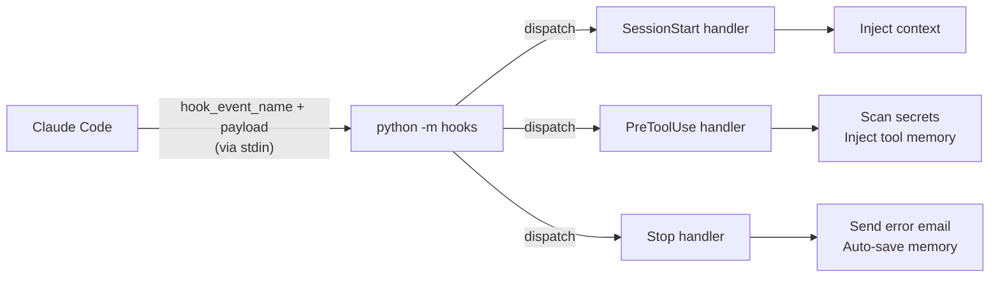

# Hook System

AgentiHooks intercepts Claude Code's lifecycle events using the [hooks system](https://docs.anthropic.com/en/docs/claude-code/hooks). When a hook event fires, Claude Code runs a shell command and passes a JSON payload via stdin. AgentiHooks reads that payload and dispatches it to the appropriate handler.

## How it works



1. Claude Code fires a hook event and runs the configured shell command
2. `python -m hooks` reads the JSON payload from stdin
3. `hook_manager.py` reads `hook_event_name` and dispatches to the matching handler
4. The handler performs its actions (logging, context injection, secret scanning, etc.)
5. Exit code controls Claude Code's behavior: `0` = allow, `2` = block

## Configuration

Hooks are wired in `~/.claude/settings.json` under the `hooks` key. Each entry maps an event name to a shell command array:

```json
{
  "hooks": {
    "PreToolUse": [
      {
        "hooks": [
          {
            "type": "command",
            "command": "python3 -m hooks"
          }
        ]
      }
    ]
  }
}
```

The install script (`agentihooks init`) writes this configuration automatically.

## Hook array behavior

{: .important }
Hook arrays are **replaced, not merged**, across scopes. All hooks must live in `~/.claude/settings.json` -- project-level settings cannot append to user-level hooks.

## Pages in this section

| Page | What it covers |
|------|---------------|
| [Events](events.md) | All 10 hook events with payload schemas and handler behavior |
| [Context Preprocessor](context-preprocessor.md) | Token compression for injected banners and tool output (scope=all) |
| [**Broadcast System**](broadcast.md) | **Real-time fleet messaging** — send a message to every active Claude Code session simultaneously. Deploy freezes, incident response, credential rotation, team coordination. Optional channel filtering via `AGENTIHOOKS_BASE_CHANNELS` env var for targeted delivery. |

{: .highlight }
**Broadcast System** is one of AgentiHooks' most powerful features. One command reaches every active session — no servers, no daemons, no pub/sub infrastructure required. [Learn more →](broadcast.md)
