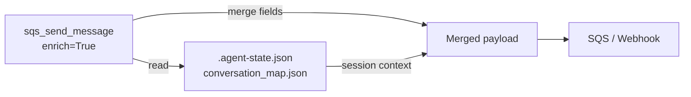

# Messaging Tools
{: .no_toc }

The Messaging category provides SQS queue integration and generic HTTP webhook calls. Both support optional **state enrichment** — automatically merging fields from the agent's `.agent-state.json` or `conversation_map.json` into outgoing payloads.

## Table of contents
{: .no_toc .text-delta }

1. TOC
{:toc}

---

## Tools

| Tool | Description |
|------|-------------|
| `sqs_send_message()` | Send a message to an SQS queue |
| `webhook_send()` | Send an HTTP request to a webhook endpoint |

---

## Tool reference

### `sqs_send_message`

```python
sqs_send_message(message_body: str, enrich: bool = True) -> str
```

Sends a JSON message to the configured SQS queue. When `enrich=True` (default), fields from `.agent-state.json` are merged into the payload before sending.

**Returns:** JSON with `success` (bool), `message_id`, `enriched` (bool), `state_fields`, `error`

---

### `webhook_send`

```python
webhook_send(
    payload: str,
    method: str = "POST",
    webhook_url: str = "",
    enrich: bool = False
) -> str
```

Sends an HTTP request with a JSON body. `method` can be `POST`, `PUT`, `PATCH`, or `GET`. If `webhook_url` is empty, uses `WEBHOOK_URL` from the environment. When `enrich=True`, merges `conversation_map.json` fields into the payload.

Authentication is via a static header: `WEBHOOK_AUTH_HEADER: WEBHOOK_AUTH_TOKEN`.

**Returns:** JSON with `success` (bool), `status_code`, `response_body`, `webhook_url`, `error`

---

## State enrichment

Both SQS and webhook tools support state enrichment to automatically include session context:



---

## Environment variables

### SQS

| Variable | Required | Default | Description |
|----------|----------|---------|-------------|
| `SQS_QUEUE_URL` | Yes | — | Full SQS queue URL |
| `IS_EVALUATION` | No | `false` | Evaluation mode flag (skips actual send) |

### Webhook

| Variable | Required | Default | Description |
|----------|----------|---------|-------------|
| `WEBHOOK_URL` | Yes* | — | Default webhook endpoint URL (*required unless passed per-call) |
| `WEBHOOK_AUTH_HEADER` | No | `X-Auth-Token` | Authentication header name |
| `WEBHOOK_AUTH_TOKEN` | No | — | Authentication token value |
| `WEBHOOK_TIMEOUT` | No | `30` | Request timeout in seconds |
| `IS_EVALUATION` | No | `false` | Evaluation mode flag |
