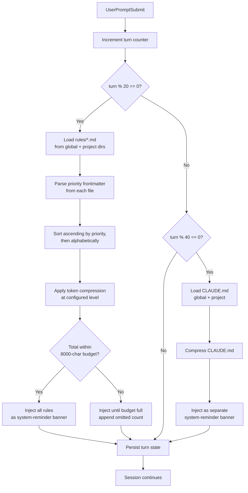
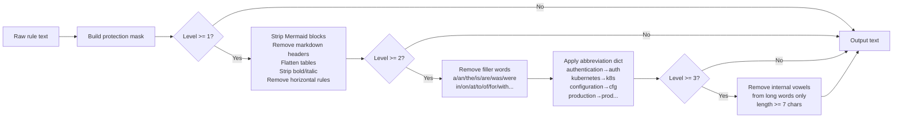

# Pillar 3: Context Intelligence
{: .no_toc }

**Your agents never forget their instructions, even 200 turns deep.**

> "Your protection window will stop being effective when Claude's context window pushes your rules to token position 50,000. Context Intelligence re-injects them before that ever happens."

## Table of contents
{: .no_toc .text-delta }

1. TOC
{:toc}

---

## The Attention Decay Problem

Large language models read your rules once — at position zero in the context window. As a conversation grows past 50, 100, or 200 turns, that early content drifts toward the attention horizon. The model hasn't "forgotten" the bytes, but the transformer's attention heads weight recent tokens far more heavily than early ones. Instructions that felt ironclad at turn 1 become soft suggestions by turn 80.

This is the **number-one reliability killer for long agent sessions**:

- The agent starts ignoring clearance constraints
- Commit style drifts away from the operator's format
- Tool calling patterns revert to defaults
- Security rules erode silently

Context Intelligence is agentihooks' answer: a multi-layer system that actively fights attention decay by keeping critical context fresh in the model's recent window at all times.

---

## The Four Layers

```
┌─────────────────────────────────────────────────────────────────────┐
│                     Context Intelligence Stack                      │
│                                                                     │
│  ┌──────────────┐  ┌─────────────────┐  ┌──────────────────────┐   │
│  │   Context    │  │    Priority     │  │   Token              │   │
│  │   Refresh    │  │   Frontmatter   │  │   Compression        │   │
│  │              │  │                 │  │                      │   │
│  │ rules / 20t  │  │ priority: 1 → N │  │ 4 levels: off→aggr   │   │
│  │ CLAUDE.md    │  │ loaded first    │  │ 30–55% savings       │   │
│  │ / 40 turns   │  │ within budget   │  │ with mask safety     │   │
│  └──────────────┘  └─────────────────┘  └──────────────────────┘   │
│                                                                     │
│  ┌──────────────┐  ┌─────────────────┐  ┌──────────────────────┐   │
│  │    Tool      │  │    Context      │  │   Thinking           │   │
│  │   Memory     │  │     Audit       │  │    Policy            │   │
│  │              │  │                 │  │                      │   │
│  │ past errors  │  │ top consumers   │  │ effort guidance      │   │
│  │ pre-tool use │  │ on session stop │  │ per model/profile    │   │
│  └──────────────┘  └─────────────────┘  └──────────────────────┘   │
└─────────────────────────────────────────────────────────────────────┘
```

---

## Context Refresh

### How it works

On every `UserPromptSubmit` event, agentihooks increments a per-session turn counter. Two independent timers govern re-injection:

| Timer | Default | Target |
|-------|---------|--------|
| Rules refresh | every 20 turns | `~/.claude/rules/*.md` + project `.claude/rules/*.md` |
| CLAUDE.md refresh | every 40 turns | `~/.claude/CLAUDE.md` + project `CLAUDE.md` |

Turn state is persisted in **Redis** with a 24-hour TTL and falls back to a per-session JSON file at `~/.agentihooks/ctx_refresh_{session_id}.json`. Because each hook invocation is a separate subprocess, in-memory state is not an option — persistence is mandatory.

### Refresh lifecycle



### Separate cadences by design

Rules and CLAUDE.md refresh on different timers intentionally. CLAUDE.md can be large (operator profiles often exceed 3,000 characters). Injecting it every 20 turns alongside rules would double the injection payload and exhaust the 8,000-character budget. By decoupling the cadences, each injection type gets its own full budget slice.

### Configuration

| Variable | Default | Description |
|----------|---------|-------------|
| `CONTEXT_REFRESH_ENABLED` | `true` | Enable/disable periodic re-injection |
| `CONTEXT_REFRESH_INTERVAL` | `20` | Re-inject rules every N user messages |
| `CONTEXT_REFRESH_CLAUDE_MD_INTERVAL` | `40` | Re-inject CLAUDE.md every N user messages. `0` disables it. |
| `CONTEXT_REFRESH_MAX_CHARS` | `8000` | Max characters per injection (~2,000 tokens) |
| `CONTEXT_REFRESH_RULES_DIR` | `~/.claude/rules` | Global rules directory |
| `CONTEXT_REFRESH_INCLUDE_PROJECT` | `true` | Also inject project-level rules from active working directory |

---

## Priority Frontmatter

When context is tight — and it always is in long sessions — not all rules can fit within the 8,000-character budget. Priority frontmatter lets you declare which rules are load-critical.

### Syntax

Add a YAML frontmatter block to any rule file:

```yaml
---
priority: 1
---

# My Critical Rule

Never commit credentials. Reference secrets via environment variables only.
```

**Priority scale:** Lower number = higher priority = loaded first.

| Priority | Meaning |
|----------|---------|
| `1` | Always load. Mission-critical. Security constraints. |
| `2` | Load before most rules. Core behavioral contracts. |
| `3` | Standard importance. |
| `5` | Default. Applied when no frontmatter present. |
| `8–10` | Nice-to-have. First to be dropped under budget pressure. |

### Budget enforcement

Rules are sorted by `(priority, filename)` — ascending priority, then alphabetically within the same priority level. The injection loop fills from the top until the budget is exhausted. Any rules that don't fit are dropped and replaced with a count line:

```
[3 rule(s) omitted — size limit reached]
```

If you see this in your logs, either raise `CONTEXT_REFRESH_MAX_CHARS` or move your lowest-priority rules to higher priority numbers.

### Tip: audit your rule sizes

```bash
# See which rules are largest
wc -c ~/.claude/rules/*.md | sort -rn

# Check which would be dropped at 8000-char budget
python3 -c "
import os, re
rules_dir = os.path.expanduser('~/.claude/rules')
files = sorted(os.listdir(rules_dir))
total = 0
for f in files:
    path = os.path.join(rules_dir, f)
    size = os.path.getsize(path)
    total += size
    status = 'OK' if total <= 8000 else 'DROPPED'
    print(f'{status:8s} {total:6d}  {f}')
"
```

---

## Token Compression Preprocessor

### The insight

LLMs predict over subword tokens, not characters. The BPE tokenizer splits `"authentication"` into 3 tokens (`auth`, `ent`, `ication`). Writing `"auth"` instead costs 1 token — and the model activates the same semantic representation. The surrounding context (`credentials`, `secrets`, `env vars`) provides enough signal for the attention mechanism to infer full meaning.

This means you can compress injected content by **30–55%** while fully preserving LLM comprehension — as long as you protect the tokens that carry critical operational semantics.

### Compression levels

| Level | Name | What it does | Token savings | Per 100-turn session |
|-------|------|-------------|--------------|----------------------|
| `0` | `off` | Passthrough — no modification | 0% | 0 tokens |
| `1` | `light` | Strip markdown formatting | ~5–10% | ~200–500 tokens |
| `2` | `standard` | Level 1 + filler word removal + abbreviation dict | ~10–20% | ~2,000–4,000 tokens |
| `3` | `aggressive` | Level 2 + internal vowel removal on long words | ~20–35% | ~4,000–8,000 tokens |

Default is `standard`. Most operators see 10–20% per injection and 2,000–4,000 tokens saved per 100-turn session with zero behavioral change.

### The compression pipeline



### The protection mask

Before any compression runs, a protection mask identifies spans that must **never be modified**. A single mistakenly compressed negation or action verb can flip behavioral meaning — the mask prevents that.

**Protected categories:**

| Category | Examples | Why |
|----------|---------|-----|
| Negation words | `never`, `don't`, `not`, `cannot`, `won't` | Meaning is in the negation |
| Assertion words | `always`, `must`, `required`, `mandatory`, `only`, `exactly` | Constraint strength lives here |
| Action verbs | `push`, `delete`, `commit`, `deploy`, `force`, `reset`, `purge` | Operational semantics — compressing `delete` is dangerous |
| ALL_CAPS identifiers | `CONTEXT_REFRESH_MAX_CHARS`, `MY_API_KEY` | Env var names must be exact |
| Code blocks | `` `command` ``, ```` ```block``` ```` | Already minimal; compressing code breaks it |
| File paths | `~/.claude/rules`, `./hooks/context` | Identifiers must be exact |
| Numbers | `8000`, `20`, `40`, `100%` | Thresholds must survive intact |
| CLI subcommands | `kubectl apply`, `docker rm`, `git push` | Tool invocations must be preserved |

The mask uses character-level span tracking. When any compression transform matches a token range, it checks for overlap with the mask before substituting. Protected spans are skipped entirely.

### Abbreviation dictionary

The built-in dictionary covers 50+ common DevOps/infrastructure terms. All replacements are longest-match-first to avoid partial substitutions.

| Full term | Abbreviated | Full term | Abbreviated |
|-----------|------------|-----------|------------|
| `authentication` | `auth` | `kubernetes` | `k8s` |
| `authorization` | `authz` | `configuration` | `cfg` |
| `environment` | `env` | `deployment` | `deploy` |
| `infrastructure` | `infra` | `repository` | `repo` |
| `namespace` | `ns` | `application` | `app` |
| `production` | `prod` | `database` | `db` |
| `development` | `dev` | `service` | `svc` |
| `permissions` | `perms` | `certificate` | `cert` |
| `parameter` | `param` | `operation` | `op` |
| `specification` | `spec` | `automatically` | `auto` |

You can extend the dictionary with a user-supplied JSON file:

```bash
# ~/.agentihooks/.env
CONTEXT_REFRESH_ABBREV_FILE=~/.claude/my-abbreviations.json
```

```json
{
  "entries": {
    "microservice": "microsvc",
    "observability": "o11y",
    "authentication-token": "auth-token"
  }
}
```

### Compression scope

| `CONTEXT_COMPRESSION_SCOPE` | Applies to |
|----------------------------|-|
| `refresh` (default) | Context refresh injections only |
| `all` | All `inject_context()` / `inject_banner()` calls + bash output filter `additionalContext` — session start banners, secrets warnings, tool memory, circuit breaker messages, threshold warnings |

Setting `scope=all` compounds savings across every injection point in the hook system.

---

## Tool Memory

Agents learn from mistakes — but only within a single session. Close the terminal and the lesson is gone. Tool Memory persists cross-session error learning so agents don't repeat the same failure twice.

### How it works

**At `PreToolUse`:** Before the agent invokes any tool, agentihooks injects a `TOOL MEMORY` banner with the last N error entries from the NDJSON store. The agent reads these before acting.

**At `PostToolUse`:** If the tool response contains an error (non-zero exit code, `is_error: true` flag, or matched error patterns in Bash output), the error is recorded to the persistent store.

**At `Stop`:** Session-end transcript scan catches MCP tool errors that Claude Code does **not** fire `PostToolUse` for — they're recorded retroactively so future sessions benefit.

### Example injection

```
┌─ TOOL MEMORY: Lessons from past sessions ──────────────────────────┐
│ [2026-04-03 14:22] Bash -- Permission denied: /var/run/docker.sock  │
│   (input: docker ps -a)                                             │
│ [2026-04-05 09:14] mcp__anton__unraid_ssh -- Connection refused     │
│   (input: host=192.168.1.10)                                        │
│ [2026-04-06 22:38] Bash -- kubectl: command not found               │
│   (input: kubectl rollout status deploy/api -n prod)                │
└────────────────────────────────────────────────────────────────────┘
```

Deduplication: memory is injected **once per tool per session** — the same tool won't receive a repeated banner on every invocation. This prevents noise in long sessions while still providing the warning at first use.

### Configuration

| Variable | Default | Description |
|----------|---------|-------------|
| `AGENTICORE_TOOL_MEMORY_PATH` | `~/.agenticore_tool_memory.ndjson` | Path to the NDJSON store |
| `AGENTICORE_TOOL_MEMORY_MAX` | `100` | Maximum entries to retain (oldest dropped first) |
| `AGENTICORE_TOOL_MEMORY_SHOW` | `15` | Entries to inject per `PreToolUse` event |

---

## Context Audit

### What it tracks

On every `PostToolUse`, agentihooks records the **byte size of the tool output** against the tool name in a per-session Redis hash (with in-process fallback). By session end, you have a complete picture of what ate your context budget.

At `Stop`, if context fill exceeds `CONTEXT_AUDIT_THRESHOLD_PCT` (default 70%), the audit report is emitted:

```
Context audit (fill: 78%, total tool output: 842K):
  Bash: 512K (61%)
  mcp__jira__search_issues: 183K (22%)
  Read: 97K (12%)
  mcp__github__list_prs: 31K (4%)
  Write: 19K (2%)
```

### Smart compact suggestions

When the audit report is available, the generic `/compact` reminder is replaced with a targeted suggestion naming the actual top consumers — so the operator knows exactly what to trim before compacting.

### Configuration

| Variable | Default | Description |
|----------|---------|-------------|
| `CONTEXT_AUDIT_ENABLED` | `true` | Enable per-tool byte tracking |
| `CONTEXT_AUDIT_THRESHOLD_PCT` | `70` | Fill % threshold for emitting the report at session end |
| `COMPACT_SUGGEST_ENABLED` | `true` | Replace generic `/compact` warnings with audit-informed suggestions |

---

## Thinking Policy

### The problem with unconstrained reasoning

Extended thinking models accumulate reasoning tokens that count against the context window. An agent using `high` effort on every response — including trivial `git status` calls — can exhaust 10–20K tokens in pure reasoning per session before accomplishing anything.

### How agentihooks governs it

At `SessionStart`, agentihooks injects effort guidance calibrated to the configured `DEFAULT_EFFORT` profile:

| Profile | Injected guidance |
|---------|------------------|
| `low` | Minimal reasoning for straightforward tasks. Escalate to medium/high only for complex architectural decisions. |
| `medium` | Standard reasoning depth. Reserve high/ultrathink for complex decisions. Prefer Sonnet for implementation; Opus for planning. |
| `high` | Full reasoning enabled. No constraint injected. |

At `PostToolUse`, if an `Agent` tool is spawned with `model=opus` under a `low` or `medium` profile, a warning is emitted before the subagent runs.

### Configuration

| Variable | Default | Description |
|----------|---------|-------------|
| `EFFORT_POLICY_ENABLED` | `true` | Inject effort guidance at session start |
| `DEFAULT_EFFORT` | `medium` | Effort profile: `low`, `medium`, `high` |
| `THINKING_BUDGET_TOKENS` | `0` | Advisory thinking token ceiling per response. `0` = no limit. |

---

## Putting It Together

A 200-turn session with a 10-file rule profile might look like this:

| Turn | Context Intelligence activity |
|------|-------------------------------|
| 1 | Session start: thinking policy injected, tool memory injected |
| 20 | Rules refresh: 10 files sorted by priority, compressed (standard), injected (8K budget) |
| 40 | Rules refresh (turn 40) + CLAUDE.md refresh — both fire at turn 40 |
| 60 | Rules refresh |
| 80 | Rules refresh + CLAUDE.md refresh |
| ... | Pattern continues every 20/40 turns |
| 200 | Stop: context audit report emitted (78% fill), top consumers named |

At each refresh, the rules land in the model's **recent** context window — not at position zero. Attention weights are high. Instructions are fresh. The agent behaves as if the session just started.

That's Context Intelligence.

---

## Quick Reference

```bash
# Key env vars for ~/.agentihooks/.env
CONTEXT_REFRESH_ENABLED=true
CONTEXT_REFRESH_INTERVAL=20
CONTEXT_REFRESH_CLAUDE_MD_INTERVAL=40
CONTEXT_REFRESH_MAX_CHARS=8000
CONTEXT_REFRESH_COMPRESSION=standard      # off | light | standard | aggressive
CONTEXT_COMPRESSION_SCOPE=refresh         # refresh | all

CONTEXT_AUDIT_ENABLED=true
CONTEXT_AUDIT_THRESHOLD_PCT=70

EFFORT_POLICY_ENABLED=true
DEFAULT_EFFORT=medium                      # low | medium | high
THINKING_BUDGET_TOKENS=0

AGENTICORE_TOOL_MEMORY_MAX=100
AGENTICORE_TOOL_MEMORY_SHOW=15
```

```yaml
# Add priority frontmatter to critical rule files
# ~/.claude/rules/operator-clearance.md
---
priority: 1
---
# Clearance Rules
...
```
