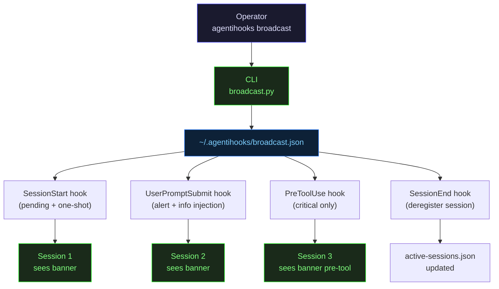

# Pillar 4: Fleet Command
{: .no_toc }

**Talk to your entire fleet — instantly.**

No other tool lets you send a message to every active Claude Code session at once. One command. Every agent. Right now.

## Table of contents
{: .no_toc .text-delta }

1. TOC
{:toc}

---

## The Megaphone

Imagine a foreman on a construction site with a megaphone. One voice. Hundreds of workers. Everyone hears it, no matter what they are doing. The work stops. The message lands. The work resumes — with the new information.

AgentiHooks gives you that megaphone for your AI agent fleet.

When production goes down, you do not hunt through terminal tabs to find which agents are mid-deploy. You do not hope that the one responsible agent happens to check a Slack channel. You type one command, and every Claude Code session in your fleet — on your laptop, on your teammates' machines, inside Kubernetes pods — sees your message before its next action.

```bash
agentihooks broadcast -s critical "Production incident — do NOT deploy."
```

That is it. Every agent. Every session. Right now.

The architecture behind this is deliberately simple: a shared file (`~/.agentihooks/broadcast.json`) that every hook invocation reads. No server. No daemon. No pub/sub broker. Claude Code hooks are stateless subprocesses — they spawn, read state, act, and exit. Fleet Command exploits that property to turn a shared file into a real-time PA system.

---

## The Broadcast Flow



The flow is pull-based, not push-based. Agents are not subscribed to a channel. Instead, every time a hook fires — on a user message, on a tool call, on session start — the hook reads the broadcast file. If there is a message waiting, it injects it into the session's context window as a banner. The message finds the agent on its next move, not via a separate notification channel.

---

## Severity Tiers

The system has three severity levels. Choose the one that matches how urgently every agent needs to know.

| Severity | Agents see it | Default TTL | Persistent | Use for |
|----------|--------------|-------------|------------|---------|
| `critical` | Every turn + every tool call | 30 min | Yes | Production incidents, emergency stops, credential rotation |
| `alert` | Every turn | 1 hour | Yes | Deploy freezes, maintenance windows, policy changes |
| `info` | Once per session | 4 hours | No | FYI notices, status updates, reminders |

### Critical — Maximum Saturation

Critical is the most aggressive mode. The agent sees your message:
- At the start of every user turn (via `UserPromptSubmit`)
- Before **every tool call** (via `PreToolUse` additionalContext)

An agent making 5 tool calls in a single turn sees a critical broadcast 6 times. It cannot miss it. This is intentional. When production is down, you do not want an agent to "notice" the broadcast and then forget it mid-reasoning. You want the message present in every decision point.

```bash
agentihooks broadcast -s critical \
  "INCIDENT: DB-PROD degraded. Read-only mode — do NOT write, migrate, or deploy."
```

### Alert — Every Turn

Alert re-injects at the start of every turn until the TTL expires. The agent is reminded on every interaction but is not interrupted mid-tool-call. Right for sustained constraints like deploy freezes.

```bash
agentihooks broadcast -s alert -t 8h \
  "Deploy freeze until 06:00 UTC. No pushes to any branch or environment."
```

### Info — Once Per Session

Info delivers once. The session sees it, it is marked delivered, and it will not appear again in that session. Right for awareness — not for enforcement.

```bash
agentihooks broadcast -s info \
  "QA environment reserved for release testing until 17:00. Use staging-dev for features."
```

---

## CLI Usage

### Manual Broadcast

```bash
# Emergency stop — critical severity
agentihooks broadcast -s critical "Production incident — do NOT deploy"

# Deploy freeze — alert, custom TTL
agentihooks broadcast -s alert -t 8h "Deploy freeze until 06:00 UTC"

# Heads-up — info, one delivery per session
agentihooks broadcast -s info "SonarQube is down for maintenance"

# Check what is currently active
agentihooks broadcast --list

# Lift everything immediately
agentihooks broadcast --clear

# Lift a specific broadcast by ID
agentihooks broadcast --clear f47ac10b-58cc-4372-a567-0e02b2c3d479
```

**Full flag reference:**

| Flag | Default | Description |
|------|---------|-------------|
| `-s`, `--severity` | `alert` | `critical`, `alert`, or `info` |
| `-t`, `--ttl` | per severity | Duration: `5m`, `30m`, `1h`, `8h`, `24h`, or seconds |
| `--persistent` | per severity | Force re-injection on every applicable event |
| `--source` | `operator` | Source tag: `operator`, `system`, `cron`, `api` |
| `--list` | | Show all active broadcasts with IDs and expiry |
| `--clear [ID]` | | Clear all broadcasts, or a specific one |

### AI-Assisted Emit

Not sure which severity fits? Use `emit`. Describe the situation in plain language. Claude Haiku parses your intent, picks the right severity and TTL, writes a clean message, and fires it — all in one step.

```bash
agentihooks broadcast emit "we have a prod incident, all agents should halt any deployments"
# → severity: critical, ttl: 30m
# → message: "Production incident in progress. Halt all deploys and destructive operations."

agentihooks broadcast emit "sonarqube is down, skip code quality scans for now"
# → severity: info, ttl: 4h
# → message: "SonarQube is currently unavailable. Skip code quality scan steps."

agentihooks broadcast emit "deploy freeze tonight, no pushes until morning"
# → severity: alert, ttl: 8h
# → message: "Deploy freeze in effect. Do not push, deploy, or restart any service."
```

**Security model for emit:** Haiku runs in a sandboxed subprocess with `Bash(agentihooks*)` as the only permitted tool. It can only call back into the agentihooks CLI — no file access, no network calls, no context from your current session. It receives your description, produces a structured broadcast, and exits. Nothing escapes the sandbox.

---

## Session Registry

Fleet Command works because it knows who is in the fleet. AgentiHooks maintains a live registry of every active Claude Code session.

**Location:** `~/.agentihooks/active-sessions.json`

```json
{
  "sessions": {
    "session-abc123": {
      "started_at": "2026-04-07T20:00:00Z",
      "pid": 12345,
      "cwd": "/home/user/dev/my-project",
      "model": "claude-opus-4-6"
    },
    "session-def456": {
      "started_at": "2026-04-07T21:15:00Z",
      "pid": 23456,
      "cwd": "/home/user/dev/infra",
      "model": "claude-sonnet-4-6"
    }
  }
}
```

- **`SessionStart`** — registers the session automatically on startup
- **`SessionEnd`** — deregisters it automatically on shutdown
- **Stale cleanup** — if a session crashes and never fires `SessionEnd`, the stale entry is removed lazily on the next read (PID no longer alive)

Check your fleet at any time:

```bash
agentihooks status
```

```
[OK] Active sessions: 4
     + sess-abc123 (PID 12345) ~/dev/my-project [claude-opus-4-6] 2h ago
     + sess-def456 (PID 23456) ~/dev/infra [claude-sonnet-4-6] 15m ago
     + sess-ghi789 (PID 34567) ~/dev/frontend [claude-haiku-4-5] 3m ago
     + sess-jkl012 (PID 45678) ~/dev/api [claude-opus-4-6] 1m ago
```

---

## Hook Integration

Broadcasts are not a separate system bolted onto agentihooks — they are wired into the hook lifecycle from the start.

| Hook Event | What happens | Injection method |
|------------|-------------|-----------------|
| `SessionStart` | Register session. Deliver any pending one-shot broadcasts immediately. | stdout banner |
| `UserPromptSubmit` | Check for undelivered messages. Inject all applicable (by severity rules). | stdout banner |
| `PreToolUse` | Check for `critical+persistent` broadcasts only. Inject as `additionalContext`. | JSON additionalContext |
| `SessionEnd` | Deregister session from `active-sessions.json`. | N/A |

**What a critical broadcast banner looks like in a session:**

```
╔══════════════════════════════════════════════════════════════════════════════╗
║  BROADCAST CRITICAL                                                          ║
╠══════════════════════════════════════════════════════════════════════════════╣
║  Production incident — do NOT deploy, write, or migrate.                    ║
║  Source: operator | Expires: 2026-04-07T23:30:00Z                           ║
╚══════════════════════════════════════════════════════════════════════════════╝
```

The banner appears in the agent's context as a `system-reminder` — it is present in the model's visible context window, not a UI overlay. The model reads it, reasons over it, and acts accordingly.

---

## File-Based Architecture

The entire broadcast system runs without a server.

**`~/.agentihooks/broadcast.json`** is the shared state. Any process can write to it. Every hook invocation reads it. Concurrency is handled by:

1. **Atomic writes** — write to `.tmp`, then `os.replace()` (atomic on POSIX)
2. **File locking** — `fcntl.flock()` for the read-modify-write cycle on delivery tracking
3. **Lazy cleanup** — expired messages are removed on the next hook read; no background process needed

**Scale tiers:**

| Scale | Backend | Configuration |
|-------|---------|---------------|
| 1–20 sessions | Local file | Default — no config needed |
| 20–200 sessions | NFS/EFS mount | `BROADCAST_FILE=/mnt/shared/agentihooks/broadcast.json` |
| 200+ sessions | Redis | Set `REDIS_URL` — Redis handles TTL and delivery tracking natively |

In a Kubernetes deployment with hundreds of agent pods, Redis replaces the file entirely. Every pod's hooks read from the same Redis key. Delivery tracking is a per-session Redis Set. Expiry is handled by Redis TTL. The file path becomes a fallback for Redis downtime.

**Configuration:**

| Variable | Default | Description |
|----------|---------|-------------|
| `BROADCAST_ENABLED` | `true` | Enable/disable the broadcast system |
| `BROADCAST_FILE` | `~/.agentihooks/broadcast.json` | Broadcast file path |
| `BROADCAST_MAX_MESSAGES` | `50` | Max concurrent broadcasts; oldest expire first |
| `BROADCAST_CRITICAL_ON_PRETOOL` | `true` | Inject critical broadcasts on `PreToolUse` |

---

## Use Cases

### Deploy Freeze

It's 11pm. You are freezing deploys until after a maintenance window. You have four sessions open — frontend, backend, infra, API. You do not want any of them to push anything.

```bash
agentihooks broadcast -s alert -t 8h \
  "Deploy freeze until 06:00 UTC. Do NOT push, deploy, or restart any service."
```

Every agent sees the banner on their next turn. Alert severity means it re-injects every turn until 6am. You do not have to remember to cancel it — the TTL handles cleanup automatically.

---

### Production Incident

The database is degraded. You need every agent to stop making writes immediately — including the one that is mid-task and about to run `kubectl apply`.

```bash
agentihooks broadcast -s critical \
  "INCIDENT: DB-PROD is degraded. Read-only mode — do NOT write, migrate, or deploy."
```

Critical severity fires before every tool call. The agent that was about to run `kubectl apply` sees the message before the tool executes. It stops. When the incident is resolved:

```bash
agentihooks broadcast --clear
```

---

### Credential Rotation

Credentials are being rotated. Any agent using the old values needs to pause.

```bash
agentihooks broadcast -s critical -t 30m \
  "Credential rotation in progress. GITHUB_TOKEN and REGISTRY_TOKEN are cycling. Pause tasks requiring those credentials."
```

The 30-minute TTL matches the rotation window. The message self-cleans when the window closes.

---

### Maintenance Window

You are upgrading the Kubernetes cluster. Agents should not schedule new workloads during the window.

```bash
agentihooks broadcast -s alert -t 2h \
  "K8s cluster maintenance 02:00–04:00 UTC. Do not apply manifests or trigger rollouts."
```

---

### Team Coordination

Multiple engineers, multiple sessions, one shared instruction.

```bash
agentihooks broadcast -s info \
  "QA environment reserved for release testing until 17:00. Use staging-dev for features."
```

Info severity delivers once per session — every active agent gets the heads-up exactly once, then the message is marked delivered and stops appearing.

---

### AI-Assisted Response

Incident alert fires in your monitoring system at 2am. You are half asleep. You do not want to think about severity levels.

```bash
agentihooks broadcast emit "prod is down, stop everything"
```

Haiku handles the rest.

---

## Limitations

- **Pull-based latency** — broadcasts are pulled on hook events. An idle session (no user input) will not see a broadcast until the next event. Worst-case latency equals time-to-next-user-message.
- **No selective targeting** — broadcasts go to all sessions. There is no per-project or per-model filter. Fleet Command is a PA system, not a DM system.
- **10,000 character cap** — Claude Code limits hook stdout and `additionalContext` to 10,000 characters per event. Keep broadcasts concise.
- **NFS flock** — some NFS configurations do not support `flock()`. Use Redis in those environments.

---

## What Is Coming

- **Selective targeting** — broadcast only to sessions matching a filter (project path, model, profile)
- **Acknowledgment** — agents can acknowledge a broadcast, removing it from their queue
- **Escalation** — if a critical broadcast is unacknowledged after N minutes, escalate (email, Slack, kill session)
- **HTTP API** — external systems (CI/CD, monitoring, incident management) can send broadcasts without the CLI
- **Dashboard** — web UI showing active sessions, pending broadcasts, delivery status per session

---

## Related

- [Broadcast System (full reference)](../hooks/broadcast.md)
- [CLI Commands — broadcast](../reference/cli-commands.md)
- [Configuration — broadcast env vars](../reference/configuration.md)
- [Pillar 1: Identity](identity.md)
- [Pillar 2: Guardrails](guardrails.md)
- [Pillar 3: Context Intelligence](context.md)
