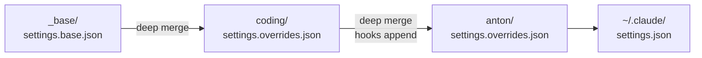
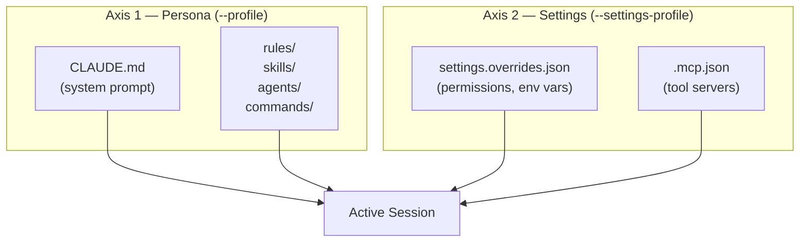

# Pillar 1: Identity
{: .no_toc }

**One command transforms your agent's entire identity.**

> A profile is not just a config file — it is the complete persona, permissions, and toolset your agent carries into every session. Swap it in seconds. Layer them for precision.

## Table of contents
{: .no_toc .text-delta }

1. TOC
{:toc}

---

## What is a profile?

A **profile** is a named bundle that defines *who your agent is* and *what it is allowed to do*:

| Component | What it controls |
|-----------|-----------------|
| `CLAUDE.md` | The agent's system prompt — behavioral rules, response style, operator model |
| `settings.overrides.json` | Permissions, env vars, model/effort defaults |
| `.mcp.json` | Which MCP tool servers are active |
| `rules/`, `skills/`, `agents/`, `commands/` | Domain-specific assets available in the session |

Profiles live under `profiles/<name>/` in the agentihooks repo or in a linked bundle. Switch one, change everything.

```bash
agentihooks init --profile coding     # feature branch agent: safe, git-guarded
agentihooks init --profile admin      # infra agent: full permissions, no guardrails
agentihooks init --profile anton       # operator-tuned persona with behavioral model
```

---

## Profile structure

```
profiles/
├── _base/
│   └── settings.base.json          # Canonical hooks, permissions, MCP server list
├── coding/
│   ├── CLAUDE.md                   # Agent system prompt (at profile root)
│   └── .claude/
│       ├── settings.overrides.json # Merged on top of _base at install time
│       ├── .mcp.json               # Profile MCP servers
│       ├── rules/                  # Behavioral rules for this profile
│       ├── skills/                 # Profile-specific skills
│       ├── agents/                 # Profile-specific agent definitions
│       └── commands/               # Profile-specific slash commands
└── admin/
    └── ...                         # Same structure
```

The `_base/settings.base.json` is the single source of truth for hook wiring. Profiles only declare what they override — the base is always preserved.

---

## Built-in profiles

Three profiles ship with agentihooks, covering the most common permission postures:

| Profile | Mode | Use case |
|---------|------|----------|
| `default` | `auto` | General use — autonomous but protected branches are sacred |
| `coding` | `acceptEdits` | Feature branch development — git-guarded, edit-confirm flow |
| `admin` | `bypassPermissions` | Infrastructure and admin tasks — full trust, no friction |

These are **settings profiles** — they control permissions and tool access. Pair them with any persona profile using the [two-axis model](#the-two-axis-model).

---

## Profile chaining

Mix and match capabilities without building a monolithic profile. Comma-separate profile names to chain them:

```bash
agentihooks init --profile coding,anton
```

Profiles are applied **left to right**. The rightmost profile has highest priority for scalar values; everything else merges additively.



### What each entity does in a chain

| Entity | Chain behavior |
|--------|---------------|
| **Settings** | Sequential deep merge — dicts combine, hook arrays append, scalars last-wins |
| **Rules / Skills / Agents / Commands** | Additive — all profiles contribute; same filename = later profile wins |
| **CLAUDE.md** | Concatenated into one file with `---` separators and `<!-- profile: name -->` markers |
| **MCP servers** | Additive — all profiles' servers accumulate |

### CLAUDE.md concatenation

In chain mode, all personas are active simultaneously:

```markdown
<!-- profile: coding -->
# Coding Agent
...

---

<!-- profile: anton -->
# Anton Profile
...
```

Claude Code loads the entire combined file as its system prompt.

---

## The two-axis model

Sometimes you want to change **permissions** without changing **who the AI is**. The two-axis model gives you independent control:



| Axis | Controls | Changed by |
|------|----------|-----------|
| **Persona** | Rules, CLAUDE.md, skills, agents, commands | `--profile` |
| **Settings** | Permissions, env vars, tool allowlists, MCP servers | `--settings-profile` |

The settings overlay is applied **after** the persona's settings overrides — it always wins on conflicts.

### Usage

```bash
# Full install: Anton persona + admin permissions
agentihooks init --profile anton --settings-profile admin

# Quick switch: escalate permissions, keep persona intact
agentihooks settings-profile admin

# Revert settings to persona defaults
agentihooks settings-profile --clear

# Via environment variable
export AGENTIHOOKS_SETTINGS_PROFILE=admin
agentihooks init --profile anton   # admin overlay applied automatically
```

**The `agentihooks settings-profile` command is the fastest way to escalate or de-escalate.** No re-install, no persona disruption — just a settings layer swap.

---

## Querying the active profile

```bash
agentihooks --query
```

```
chain: [coding, anton] (global)
```

> Per-repo identity (`agentihooks init --local` / `.agentihooks.json`) was
> removed 2026-05-07. The active profile chain is now global only.

---

## The bundle system

Profiles are shareable. A **bundle** is an external directory of custom profiles linked into agentihooks once:

```
my-bundle/
├── .claude/                  # Assets shared by all bundle profiles
│   ├── rules/
│   └── .mcp.json             # Bundle-wide MCP servers
└── profiles/
    ├── infra-ops/            # Custom profile
    │   ├── CLAUDE.md
    │   └── .claude/
    └── reviewer/
        └── ...
```

```bash
# Link the bundle (once)
agentihooks bundle link ~/dev/my-bundle

# All bundle profiles are now discoverable
agentihooks --list-profiles

# Use a bundle profile like any built-in
agentihooks init --profile infra-ops
```

Bundle profiles merge through the same 3-layer system:

```
agentihooks built-in  →  bundle global .claude/  →  profile-specific .claude/
```

Later layers win on conflicts. The bundle is a clean separation point — your team customizations live there, personal overrides live in profile-specific files.

---

## Environment variables

| Variable | Default | Description |
|----------|---------|-------------|
| `AGENTIHOOKS_PROFILE` | `default` | Profile when `--profile` is not passed. Useful in CI/Docker. |
| `AGENTIHOOKS_SETTINGS_PROFILE` | *(none)* | Settings overlay profile applied automatically on every init. |

```bash
# In a Dockerfile or CI environment
ENV AGENTIHOOKS_PROFILE=coding
RUN agentihooks init   # uses coding profile automatically
```

---

## Creating a custom profile

```bash
# 1. Copy an existing profile as a starting point
cp -r profiles/default profiles/myprofile

# 2. Write the system prompt
# Edit profiles/myprofile/CLAUDE.md

# 3. Add profile-specific assets (optional)
# profiles/myprofile/.claude/rules/
# profiles/myprofile/.claude/skills/
# profiles/myprofile/.claude/settings.overrides.json

# 4. Install it
agentihooks init --profile myprofile
```

{: .note }
Hooks are always wired from `_base/settings.base.json`. Profiles control persona, permissions, and assets — not the underlying hook infrastructure.

> `profile.yml` and the runtime overlay system were removed 2026-05-07.
> Profile metadata, `claude:` launch fields, and `allowedOverlays` no
> longer exist. Profile chaining (comma-separated `--profile`) remains the
> only mechanism for combining profiles, applied at install time.

---

*Next: [Pillar 2 — Guardrails](guardrails.md) — What your agents are protected from.*
