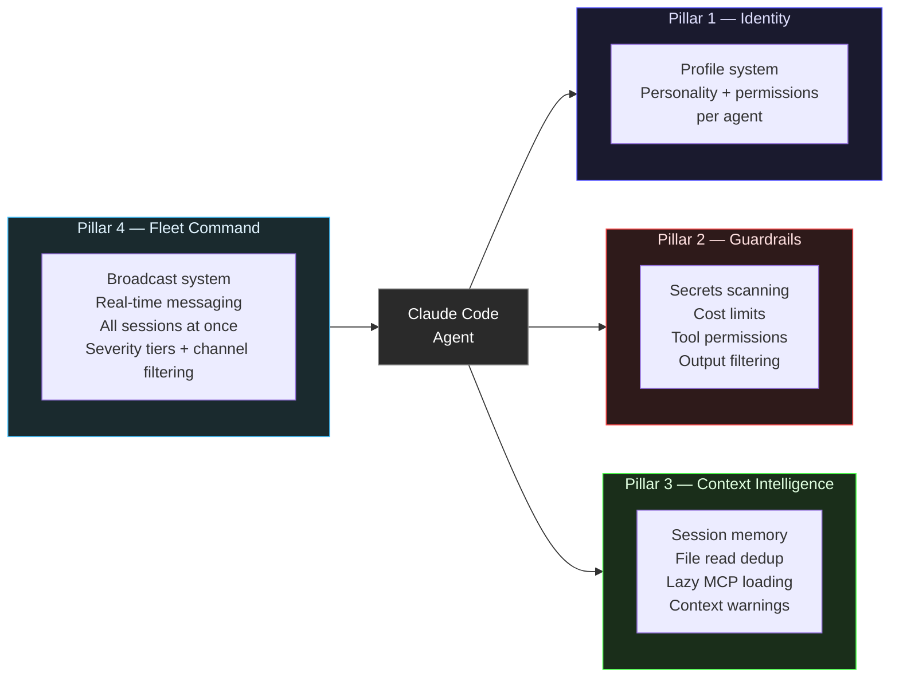

# AgentiHooks
{: .fs-9 .fw-700 }

The definitive Claude Code harness — built on four pillars that make your agents safer, smarter, and controllable at any scale.
{: .fs-5 .text-grey-dk-100 .mb-6 }

<div class="hero-actions text-center mb-8" markdown="0">
  <a href="#install" class="btn btn-primary fs-5 mr-2">Get Started</a>
  <a href="{{ site.baseurl }}/docs/bundles/" class="btn btn-green fs-5 mr-2">Bundles</a>
  <a href="{{ site.baseurl }}/docs/cost-management/" class="btn fs-5 mr-2">Cost Management</a>
  <a href="https://github.com/The-Cloud-Clockwork/agentihooks" class="btn fs-5" target="_blank">View on GitHub</a>
</div>

[](https://github.com/The-Cloud-Clockwork/agentihooks/blob/main/LICENSE)
[](https://github.com/The-Cloud-Clockwork/agentihooks/actions/workflows/ci.yml)
[](https://python.org)
{: .text-center .mb-8 }

---

## The Four Pillars
{: .fs-7 .fw-600 }

AgentiHooks is organized around four core capabilities. Together they make it the definitive harness for running Claude Code at any scale — from a single session on your laptop to thousands of agent pods in Kubernetes.



---

### Pillar 1: Identity
{: .fs-5 .fw-600 }

**Every agent knows who it is and what it is allowed to do.**

The profile system gives each agent a distinct personality, skill set, and permission boundary. Swap from `coding` to `ops` to `minimal` with one flag. Each profile carries its own CLAUDE.md, tool permissions, MCP whitelist, and rules. Agents running the same code can have completely different identities.

[Read Pillar 1: Identity →]({{ site.baseurl }}/docs/pillars/identity/){: .btn }

---

### Pillar 2: Guardrails
{: .fs-5 .fw-600 }

**Agents that stay in bounds — automatically.**

Guardrails run on every hook event. Secret patterns are scanned before any tool output reaches the model. Cost limits cut off sessions before they blow the weekly quota. Tool permissions block operations the operator never approved. Output filtering strips the 3000-line `docker logs` dump before it floods context. The operator can also flip a session-wide bypass with `disable controls` to lift branch / PR / release-merge / hotfix / non-main-force-push gates at once for high-velocity work — HARD FLOOR (push-to-main, secrets-in-files) still holds. Guardrails are not opt-in safety theater — they are always on, zero configuration required.

[Read Pillar 2: Guardrails →]({{ site.baseurl }}/docs/pillars/guardrails/){: .btn }

---

### Pillar 3: Context Intelligence
{: .fs-5 .fw-600 }

**Agents that use context efficiently — so sessions run deeper and cost less.**

File read deduplication blocks a re-read if the file has not changed since last read. Lazy MCP loading holds all 26 tool schemas out of context until the agent actually uses one. Threshold warnings fire at 60% and 80% context fill. Session memory writes a structured handoff on `Stop` so the next session starts informed. The result: 30–50% fewer tokens, sessions that run to completion instead of compacting mid-task.

[Read Pillar 3: Context Intelligence →]({{ site.baseurl }}/docs/pillars/context/){: .btn }

---

### Pillar 4: Fleet Command
{: .fs-5 .fw-600 }

**Talk to your entire agent fleet — in real time.**

No other tool does this. One command. Every active Claude Code session. Right now.

```bash
agentihooks broadcast -s critical "Production incident — do NOT deploy."
```

The broadcast system delivers your message to every session on its next hook event — before the next turn for `alert`, before every tool call for `critical`. Three severity tiers. File-based at small scale (no server needed), Redis-backed at Kubernetes scale. AI-assisted `emit` subcommand lets Claude Haiku pick the right severity from natural language. The session registry tracks every active agent so you know exactly who is in your fleet. Optional **channel-tagged** delivery for targeted messaging — subscribe a session to specific channels via the `AGENTIHOOKS_BASE_CHANNELS` env var (set per-profile, per-repo, or per-container) and only the right pods hear the right messages.

[Read Pillar 4: Fleet Command →]({{ site.baseurl }}/docs/pillars/fleet-command/){: .btn .btn-blue }

---

## Bundles — your Claude Code stack as one repo
{: .fs-7 .fw-600 }

A **bundle** is a single external repository containing everything that defines your AI environment: profiles, MCP servers, skills, sub-agents, slash commands, and coding rules. AgentiHooks is the engine; the bundle is your data. Clone it on any machine, run one command, and you have your full setup.

```
my-bundle/
├── .claude/                          # Bundle-global assets (skills · agents · commands · rules · MCPs)
│   ├── .mcp.json
│   ├── skills/
│   ├── agents/
│   ├── commands/
│   └── rules/
└── profiles/                         # One per identity / context
    ├── infra-ops/
    │   ├── CLAUDE.md                 # Behavior rules
    │   └── .claude/                  # Profile-scoped overrides + MCP servers
    └── coding-strict/
        └── ...
```

Three layers merge at `agentihooks init`: built-in AgentiHooks base → bundle globals → active profile. Later layers override earlier ones, so you start with sane defaults, layer in team customizations, then tune per identity.

```bash
# Link your bundle once
agentihooks init --bundle ~/dev/my-bundle

# List every profile your bundle exposes
agentihooks --list-profiles

# Activate one
agentihooks init --profile infra-ops

# Chain several
agentihooks init --profile coding,infra-ops
```

**Public reference**: [`agentihooks-bundle-example`](https://github.com/The-Cloud-Clockwork/agentihooks-bundle-example) — clone it, look at the layout, fork it, ship your own.

[Bundles deep-dive →]({{ site.baseurl }}/docs/bundles/){: .btn .btn-green }

---

## Install
{: #install }

```bash
pip install agentihooks
```

Then wire everything into Claude Code in one command:

```bash
agentihooks init
```

That's it. Hooks are active and the `hooks-utils` MCP server's 9 tools (channels + enforcement) are registered the next time you start `claude`.

---

## Save tokens. Spend less. Ship more.
{: .fs-6 .fw-500 }

{: .highlight }
> AgentiHooks targets **30–50% token reduction** in agentic sessions. Every feature is on by default — zero configuration required.

| What burns your tokens | How AgentiHooks fixes it | Savings |
|------------------------|--------------------------|---------|
| `docker logs` dumps 3000 lines into context | **Bash output filtering** — auto-truncates verbose output | 5K–50K tokens/cmd |
| Claude re-reads the same file 4 times | **File read dedup** — blocks unchanged re-reads | 2K–20K tokens/read |
| 26 MCP tool schemas loaded every turn | **Lazy loading** — schemas expand only when used | ~79K tokens/session |
| Context hits 100%, session resets, all work lost | **Threshold warnings** — alerts at 60% and 80% | Entire session |
| No visibility into spend | **Live statusline** — cost, burn rate, cache ratio every turn | Prevents waste |
| Hit weekly quota mid-task | **Native rate limits** — session/weekly usage on your statusline | Prevents limit hits |

**The result:** Your weekly quota lasts longer. Sessions run deeper before compaction. You see exactly where every token goes.

[Full cost management guide →]({{ site.baseurl }}/docs/cost-management/){: .btn .btn-green }

---

## Choose a profile

Profiles set the agent's personality and tool permissions. The default profile works for most people.

```bash
# See what's available
agentihooks init --list-profiles

# Install with a specific profile
agentihooks init --profile coding

# Check which profile is active
agentihooks init --query
```

---

## Load your secrets — the `agentienv` shell function

Claude Code expands `${VAR}` in MCP configs from its own process environment. The cleanest way to get secrets into that environment is the `agentienv` shell function:

```bash
# One-time setup — writes a managed block to ~/.bashrc
agentihooks init

# Reload your shell
source ~/.bashrc
```

`agentienv` is now **auto-called** on every new shell — your vars load automatically. You only need to call it manually if you add new env files mid-session:

```bash
agentienv        # reload vars after adding a new *.env file
claude           # inherits all your vars
```

All `${VAR}` placeholders in MCP server configs resolve automatically.

---

## Restrict which tools load

By default all tools across both categories are active. Use environment variables in the MCP server's `env` block (inside `~/.claude.json`) to cut that down.

**Restrict by category** — only load the categories you need:

```json
"env": {
  "MCP_CATEGORIES": "channels"
}
```

Valid category names (comma-separated, any order):

```
channels  enforcement
```

**Restrict to specific tools** — allowlist exact tool names within the loaded categories:

```json
"env": {
  "MCP_CATEGORIES": "channels",
  "ALLOWED_TOOLS": "channel_list,channel_publish,brain_status"
}
```

`ALLOWED_TOOLS` is an **allowlist** — only the tools you name will be active. Tools not in the list are removed at server startup.

**Where to edit:** open `~/.claude.json`, find the `hooks-utils` server under `mcpServers`, and update its `env` block. Restart Claude Code for the change to take effect.

**Verify what's active:** ask Claude Code "what MCP tools do you have?" — the `hooks-utils` server lists its loaded channels/enforcement tools.

---

## Add more MCP servers

Drop `.json` files with a `mcpServers` key into `~/.agentihooks/`, then use the interactive MCP manager:

```bash
# List available MCP files
agentihooks mcp

# Two-stage install: pick a file, then pick which servers to install
agentihooks mcp install

# Two-stage uninstall: pick a file, then pick which servers to remove
agentihooks mcp uninstall

# Install a specific file directly (all servers, no prompting)
agentihooks mcp add /path/to/.mcp.json

# Re-apply all installed files after edits
agentihooks mcp sync
```

Registered files are tracked in `~/.agentihooks/state.json` and re-applied automatically on every `agentihooks init` run.

---

## Fork & extend

AgentiHooks is a platform, not just a tool. Fork the repo and you immediately inherit:

- The full hook lifecycle (SessionStart → Stop) wired into Claude Code
- MCP tools across 2 categories (channels, enforcement), ready to use or filter down
- Profile system — swap agent personality and permissions with one flag
- Install scripts, settings management, and credential loading

**Add your own tools in three steps:**

1. Create `hooks/mcp/mytools.py` with a `register(server)` function
2. Add `"mytools": "hooks.mcp.mytools"` to `_registry.py`
3. Run `agentihooks init` — your tools are live

**Add your own profile:**

Create a directory under `profiles/<name>/` with `.claude/CLAUDE.md` and
`.claude/.mcp.json`. Run `agentihooks init --profile <name>`.

**Stay merge-friendly:**

Your additions live in new files and new directories. Existing files are
untouched. When you pull upstream changes the diff is clean.

Full extension guide → [Extending AgentiHooks]({{ site.baseurl }}/docs/extending/)

---

## Uninstall

```bash
agentihooks uninstall        # prompts for confirmation
agentihooks uninstall --yes  # scripting / no prompt
```

User data in `~/.agentihooks/` (logs, memory, state) is left in place. Remove it manually if you want a full reset:

```bash
rm -rf ~/.agentihooks
```

---

## Documentation

| Section | What it covers |
|---------|---------------|
| **[The Four Pillars]({{ site.baseurl }}/docs/pillars/)** | Identity, Guardrails, Context Intelligence, Fleet Command — the conceptual foundation |
| **[Getting Started]({{ site.baseurl }}/docs/getting-started/)** | Install, init, per-project config, profiles |
| **[Cost Management]({{ site.baseurl }}/docs/cost-management/)** | Output filtering, read dedup, lazy loading, rate limit display |
| **[Hook System]({{ site.baseurl }}/docs/hooks/)** | All 10 hook events, broadcast system, lifecycle reference |
| **[MCP Tools]({{ site.baseurl }}/docs/mcp-tools/)** | MCP tools across 2 categories (channels, enforcement) |
| **[Reference]({{ site.baseurl }}/docs/reference/)** | CLI commands, configuration variables, env vars |
| **[Extending]({{ site.baseurl }}/docs/extending/)** | Add tools, add profiles, fork safely |
| **[Bundles]({{ site.baseurl }}/docs/bundles/)** | Prebuilt capability bundles |
| **[Connectors]({{ site.baseurl }}/docs/connectors/)** | Integrations with external systems |

---

## Related projects

| Project | Description |
|---------|-------------|
| [agenticore](https://github.com/The-Cloud-Clockwork/agenticore) | Claude Code runner and orchestrator (uses agentihooks) |
| [agentibridge](https://github.com/The-Cloud-Clockwork/agentibridge) | MCP server for session persistence and remote control |

---

<p align="center">
  Built by <a href="https://github.com/The-Cloud-Clockwork">The Cloud Clockwork</a> &middot;
  <a href="https://github.com/The-Cloud-Clockwork/agentihooks/blob/main/LICENSE">MIT License</a>
</p>
