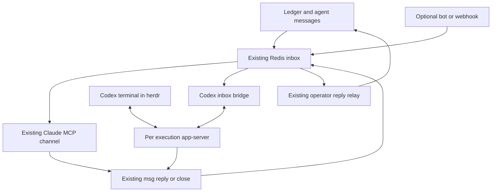

> **Note (2026-10-08).** Copied verbatim from the operator's file
> `C:\Users\nesto\Downloads\Codex-Channels-Implementation-Plan.md`
> (WSL `/mnt/c/Users/nesto/Downloads/Codex-Channels-Implementation-Plan.md`).
> Re-checked against dev `ee1f0c71` / `5509132f`; every seam still exists.
> Operator changes: after CXCH-08 passes, `app_server` becomes the default and
> `legacy` stays for rollback; CXCH-10 is out of scope.
> This is an interim home until plan artifacts move to MinIO or S3.
> Everything below this note is the unmodified source.

# Codex Channels implementation plan for agentihooks

## 1 Goal and selected design

Give Codex swarm agents the same practical inbox behavior as Claude: messages reach the correct running conversation while idle or busy, the agent answers through the existing inbox, and the operator sees the answer in the existing ledger. Keep herdr, profiles, account routing, seats, task claims, handoffs, and the swarm controller.

Implement a **Python adapter inside agentihooks that connects the existing Redis inbox to a managed Codex app-server**. Start one app-server per admitted Codex execution. Where the installed Codex release passes the attachment tests, show its native terminal UI in herdr connected to that same server and thread. The server and bridge survive viewer disconnection.

The existing ledger and `agentihooks msg` commands are the first message sources. A Telegram, Discord, or generic webhook adapter can later submit to the same inbox; none is required to achieve parity within the swarm.

| Property | Contract |
|---|---|
| Repository | `the-cloud-clockwork/agentihooks` |
| Baseline | `dev` at `d2dd3ccaef4640dac7d906d8b4fbcbc4a901f55a`, inspected 2026-10-08 |
| Status | Proposed implementation; live compatibility qualification is the first work package |
| Suggested repository path | `/Codex-Channels-Implementation-Plan.md` |
| Implementation owner | agentihooks |
| Runtime language | Python, using the repository's existing async and Redis conventions |
| Initial platform | Existing local Linux or WSL hive; remote Kubernetes integration follows Swarm v2 contracts |
| Initial default | Existing delivery retained; new app-server mode opt-in per new execution |
| Completion | Idle and busy delivery, correct replies, terminal continuity, recovery, and mixed-fleet regressions proved on a scratch swarm |

Final branch recheck: `dev` advanced to `4a206fc02b667b73eed0e2d63c3df777bfc46c29`. The intervening commit changes two Sonar workflow assertions in tests only; the inspected runtime and inbox source is unchanged. Source links remain pinned to the original review snapshot.

This is an additive implementation slice alongside `Swarm-v2.md`, not a replacement for that program. New paths, fields, settings, and internal APIs below are proposed unless identified as existing. Repository code is the current baseline; issue descriptions explain intent or historical failures and do not establish deployment state.

## 2 What already exists

The custom Claude channel in this repository does **not** depend on Bun. `scripts/inbox/channel.py` is a Python MCP server. Its launcher runs Python, and it advertises `claude/channel` and sends `notifications/claude/channel`. Bun is used by Anthropic's supplied channel plugins, not by this custom inbox implementation. [R1] [O3]

There are also two different meanings of “channel” in this repository. Broadcast topics such as brain and amygdala are subscription filters around the broadcast system. The Claude inbox channel is a push transport for addressed inbox items. This slice replaces the latter transport for Codex; it does not merge broadcasts into the inbox. [R1] [R2]

| Existing seam | Observed behavior | Consequence for this change |
|---|---|---|
| `scripts/inbox/store.py` | Redis items, open and pending indexes, history, aliases, seat resolution, replies, and `NOTIFY` publication | Reuse the message authority and address model |
| `scripts/inbox/channel.py` | Python MCP push, notification wake plus periodic scan, reply tool | Preserve Claude; add a Codex transport alongside it |
| `scripts/inbox/seen.py` | Shared per-agent ledger-reference marks; `claim()` marks items delivered before returning them | Do not call this unchanged before a remote RPC; it would acknowledge too early |
| `scripts/swarm/runtime.py` | herdr launches; `--inbox-channel` only for Claude; conversation discovery and liveness tied to panes/processes | Add app-server-aware launch and observation capabilities |
| `scripts/init_agent.py` | Profile preparation, route reporting, native CLI invocation, startup evidence | Extend this launch path, preserving its validated binding |
| `scripts/inbox/wake.py`, `waker.py` | Immediate idle Codex worker pane wake; master panes excluded; escalation remains in tick | Disable typed wake only for an execution whose new transport owns delivery |
| `scripts/profiles/codex_master.py` | Master repeatedly uses foreground `swarm wait --inbox` | Remove that requirement only for qualified push-mode masters |
| `hooks/hook_manager.py` | Hook inbox delivery and target capability checks; Codex delivery also uses supported post-tool context paths | Coordinate hook delivery with the new transport rather than allowing a race |
| `scripts/swarm/delivery.py` | Addressed chat goes to inbox; operator replies relayed to ledger | Keep this routing and its authorship checks |
| `scripts/codex_router.py` | Account selection and credential filtering; token launches avoid an unrelated default daemon | Run routing before server launch, not independently for every attached viewer |
| `hooks/context/account_sessions.py` | Interactive sessions count toward quota; app-server processes intentionally excluded | Count managed executions once, even without a viewer |
| `scripts/swarm/execution.py` | Execution IDs, seat generations, immutable identity, local/Kubernetes metadata | Bind bridge and server to admitted execution identity |
| `scripts/swarm/live_binding.py`, `launch_check.py` | Actual profile, hooks, account, model, effort, overlays, and ledger join are checked | Extend the evidence to the server process and thread settings |

Important existing contracts: one task per worker life, retained seat memory, explicit resume versus fresh start, no automatic pane typing into the master, and one authoritative controller for task claims. [R3] [R4] [R5]

## 3 Scope and parity requirements

The first release must deliver:

1. An operator ledger chat, comment, or answer reaches its intended Codex agent promptly.
2. An idle Codex master receives work without an active waiting tool, an operator keystroke, or a typed herdr wake.
3. A busy Codex agent receives new input in its current conversation, subject to the installed protocol's safe steering behavior.
4. An agent-to-agent message follows the same path, including Claude-to-Codex and Codex-to-Claude.
5. Replies use the real agent author, original inbox item, and original recipient; terminal narration is not automatically a sent message.
6. Message ownership follows seat and task continuity through a handoff. A reused engineer name or another task's successor cannot receive stale task mail.
7. herdr continues showing and opening Codex conversations. A closed viewer does not mean the execution died.
8. The operator's partially typed terminal prompt is never overwritten by the bridge.
9. New transport failure is visible and recoverable, with no silent loss or blind duplicate submission.

Keep optional bot/webhook integration after these requirements. Do not add another coding-task queue, another scheduler, a Bun service, a transcript database, or a new product. The Codex server and bridge are agentihooks runtime helpers within the worker responsibility already defined by Swarm v2.

## 4 Architecture



The controller still chooses the task, lane, account, profile, model, and worktree. The bridge owns only message delivery for one admitted execution. It cannot claim a new task, choose another account, or start a replacement execution on its own.

### Runtime ownership

Use one supervised execution unit containing an explicit Codex app-server and its Python bridge. The optional native terminal is a viewer/input client, not the lifetime owner. Keep the unit on the hive or worker host; it must not depend on a laptop remaining connected.

Prefer a private Unix socket on Linux/WSL, in a directory accessible only to the execution's user. Choose a short, unique socket path to respect operating-system path limits. Qualify native TUI attachment and simultaneous clients on the pinned version before enabling this topology. An authenticated loopback WebSocket is an alternative only if required by the qualified version; never use an unauthenticated public listener.

One server per execution prevents a shared daemon from selecting the wrong account or mixing thread-level process environment. Keep `runtime_backend=local` for local execution; app-server is the Codex session transport, not a new placement backend. Future Kubernetes execution uses the same adapter inside its existing supervisor.

### Native terminal qualification

Official Codex documentation describes `--remote` for connecting the TUI to an app-server over WebSocket or a Unix socket, including resume. [O2] That does not, by itself, prove two-client event delivery, approval ownership, or viewer-detach behavior for the installed binary.

The selected experience is one live thread visible in the native TUI and writable by the inbox bridge. Prove that both clients see the same thread, that the terminal updates after bridge input, and that closing/reopening the viewer does not start another conversation. If this fails, stop promotion of native-terminal parity. Retain the current terminal mode while a headless app-server prototype proves inbox transport. Do not quietly substitute a read-only log tail for the required terminal experience or create another server and call that an attachment.

## 5 Codex protocol boundary

Use official app-server methods through a version-qualified client. Initialize each connection, then use `thread/start` or `thread/resume`. Send idle work with `turn/start`; use `turn/steer` with `expectedTurnId` for active work. Read streamed events and inspect completion status. Use `thread/read` for reconciliation, not as a replacement for live ownership. Handle server-initiated approval and user-input requests explicitly. Generate schemas from the installed CLI. [O1]

These names are protocol facts; the lifecycle, delivery journal, arbitration, and policies below are agentihooks design decisions. The app-server/remote transport carries development or experimental qualifications in the documentation, so the exact working CLI release and schema digest are release evidence, not an assumed universal contract. [O1] [O2]

Do not send Claude's MCP channel notifications to Codex. Do not implement push by repeatedly running `codex exec`, writing to an interactive stdin stream, or using `herdr agent prompt` for qualified executions. Ordinary MCP tools remain available for agent actions; an MCP tool registry alone does not implement this inbound transport.

## 6 Launch and identity contract

### Launch sequence

1. The existing controller admits the worker or master and resolves the task, seat, and profile as today.
2. For opt-in Codex execution, allocate an execution identity through the existing registry, including the exact predecessor for replacements. Local admission wiring is part of this slice; the presence of an identity dataclass alone is insufficient.
3. Resolve the existing account router once and reserve capacity. Create a filtered child environment containing only the selected account credential. Record the account label, never credential contents.
4. Render the intended Codex profile and overlays. Use an execution-private writable runtime home, reusing the existing profile renderer and explicit settings. Retain required sessions/configuration through the supported home policy; do not copy every account's authentication into it.
5. Start the explicit server under the supervisor, using the account-specific environment and qualified flags. Do not mechanically prepend the interactive `--no-daemon` workaround to an app-server command: verify supported server flags and authentication independently.
6. Connect the bridge, verify server identity, load the intended instructions/settings, and start or resume the correct thread. Persist the binding before making delivery eligible.
7. Send the task's opening prompt exactly once from the launch owner. TUI attachment does not also submit it.
8. Attach the native TUI in the herdr pane to that same endpoint/thread, if qualified and requested.
9. Pass launch checks for profile, hooks, account, model, effort, overlays, seat, ledger join, bridge health, and conversation mapping. Failed checks use the existing bounded recovery policy.

### Proposed binding record

Store a versioned transport side record keyed by swarm and execution ID rather than expanding every legacy strict decoder immediately:

| Field | Meaning |
|---|---|
| `schema_version` | Transport-record version |
| `execution_id`, `execution_generation` | Existing execution registry identity |
| `seat`, `seat_generation`, `agent_name`, `task_id` | Current recipient and task continuity; seat and execution generations are distinct |
| `transport` | `codex_app_server` |
| `server_pid`, `server_start_identity`, `host_id` | Qualified local ownership; PID alone is insufficient |
| `endpoint_ref` | Private local endpoint; never a credential |
| `thread_id`, `session_id` | Values returned by Codex; do not assume they are interchangeable |
| `active_turn_id` | Current observed turn, cleared only through reconciled state |
| `account`, `profile`, `bundle_revision`, `model`, `effort` | Actual launch binding and relevant observed settings |
| `bridge_owner`, `bridge_epoch`, `lease_expires_at` | Exclusive delivery ownership |
| `state`, `last_transport_activity`, `last_reconcile_at`, `last_error_class` | Transport health without message bodies or secrets |

Keep the repository's existing `conversation_id` as the resumable native conversation identifier after proving its mapping to the returned thread. Store separate session identity where required for hooks and telemetry. Preserve additive snapshot/export behavior and predecessor history.

## 7 Delivery and recovery algorithm

### Subscribe and scan

Subscribe to the existing Redis `NOTIFY`, then scan the durable inbox immediately. A notification is a hint; the stored item is authoritative. Reconcile periodically, including after timeouts and reconnects, so a missed pub/sub event cannot strand a message. Reuse recipient resolution for names, aliases, and seats.

Use a single in-flight submission per thread in the bridge. Preserve inbox order by its existing sequence/time ordering. Start with individual envelopes; optimize batching only after correctness and payload limits are measured. Coalesce wake hints, not distinct messages.

### Reserve before sending and commit after evidence

The existing `claim()` calls `deliver()` and writes seen marks before the caller sends data. That is unsuitable for an RPC that can fail after the claim. Add an atomic reservation and acceptance layer for opted-in executions. A lease is not the inbox `delivered` state.

1. Verify the execution, current seat occupant/generation, task association, bridge owner, and message state.
2. Atomically reserve the message and its `(recipient, ref)` deduplication domain, if a ledger reference exists. Store an immutable payload digest and delivery ID before sending.
3. Recheck authority immediately before dispatch. If replaced or fenced, stop and release only a definitely unsent reservation.
4. Submit an envelope carrying the delivery ID and inbox item ID into the bound thread.
5. On positive acceptance evidence, atomically mark delivery accepted, transition the inbox item to `delivered`, and write the compatible seen mark. Acceptance means the runtime accepted the input, not that the agent completed the requested work.
6. Let existing explicit read/reply/close actions progress the item. An accepted message that remains open still needs health visibility.

Coordinate **all** competing consumers: hook inbox delivery, ledger hook, ledger watch, the Claude channel if it can access the same recipient, and the new bridge. For a qualified push-mode execution, the bridge owns inbox and corresponding ledger-event context delivery. Other paths consult the same owner/reservation contract and skip those events. Preserve unrelated ledger overview/refocus context. A check outside a Redis transaction is not sufficient to prevent a race.

### Proposed transport journal states

| State | Meaning | Permitted recovery |
|---|---|---|
| `reserved` | Persisted ownership; send has not begun | Release after owner expiry only when definitely unsent |
| `submitting` | A write may have reached Codex | Reconcile before any retry |
| `accepted` | RPC response or positive thread evidence confirms input | Never resubmit merely because no reply exists yet |
| `unknown` | Connection failed around acceptance | Hold competing delivery; inspect native history using delivery ID and digest |
| `rejected` | Explicit refusal proves no acceptance | Requeue if transient and authority still valid; otherwise surface the refusal |
| `superseded` | Execution or task authority changed | Existing seat/exit policy decides transfer or withdrawal |

Use the existing Redis coordination domain, with its persistence/backup expectations documented. The journal is not a second task queue. Retain unresolved and accepted records long enough to cover inbox retention and recovery; do not expire an unknown outcome just to unblock retries.

### Busy and idle handling

| Observed condition | Proposed behavior |
|---|---|
| Idle, ready, no pending approval | Start a turn with the message envelope |
| Active turn | Steer that turn using its observed ID |
| Active turn changed before steering | On a definitive rejection, refresh state and choose start or steer again |
| Waiting for approval or operator input | Keep message reserved/queued under a bounded policy; surface the blocking request; do not answer it from inbox text |
| Server disconnected or thread state uncertain | Persist pending/unknown state and reconcile; no pane fallback |
| Explicit terminate or interrupt control | Use the existing authorized control path; ordinary messages cannot impersonate it |

Do not equate steering with cancellation of a running shell command. A long-running tool may delay when the model acts on the new input. Measure input acceptance and agent reaction separately.

### Ambiguous outcome recovery

JSON-RPC request IDs are correlation IDs, not a documented idempotency guarantee. After a socket failure, inspect the stored thread for the delivery marker and matching digest. Positive evidence can establish acceptance. Absence is only evidence of non-delivery after the server is quiescent and the qualified history API is known to be complete for that attempt.

When neither acceptance nor non-acceptance can be established, leave the attempt `unknown`, flag it, and require an explicit recovery decision. Do not replay an instruction with possible external effects just because a request timed out. This design aims for duplicate-resistant delivery with explicit uncertainty, not an unsupported claim of exactly-once model execution.

## 8 Message meaning and reply behavior

Render the envelope through a shared formatter, for example:

```text
[swarm delivery] inbox message <item_id>
delivery_id: <delivery_id>
sender: <verified_sender>
recipient: <agent_name>
task: <task_id>
kind: work or fyi

<message text>

Reply using agentihooks msg reply <item_id> <text>.
Otherwise close this item with an appropriate reason.
```

The existing `[swarm delivery]` prefix is already excluded by `is_operator_prompt()`. Preserve that behavior and capture actual native hook payloads during qualification. A bridge message can arrive in a user-input protocol field while still being automated input for agentihooks presence and permission logic. Text claiming to be an operator, a system message, or an approval cannot grant that authority.

Ledger-origin operator messages retain their authenticated ledger authorship. They must not accidentally toggle “operator present in this terminal,” renew the terminal presence window, or create a branch/release/approval signal through the typed-prompt path. Bot messages require their own authenticated principal mapping.

Keep `agentihooks msg reply`, `read`, and `close` as the first release's action interface. It already handles sender and recipient semantics, including the special swarm-sender close behavior. A later target-neutral MCP wrapper can call the same validated service; do not add experimental dynamic tools solely to imitate Claude's tool name.

Do not forward every assistant token or final turn to the operator. Streamed text belongs in the terminal and observability. Only an explicit inbox reply or existing `say --to operator` action publishes to the ledger.

`InboxStore.reply()` currently sends a reply and then closes the original in separate steps. Add a transaction/idempotency boundary for retried replies: the same original item, actor, and reply operation returns the recorded result without creating another outgoing message. Reject reuse with different text. Likewise, reconcile ledger relay against the outgoing inbox ID after an uncertain page write. Preserve existing page wording validation and actual sender attribution. Automatic delivery does not itself require automatically replying to FYI messages.

## 9 Hooks, approvals, profiles, and evidence

The app-server process must inherit the same applicable profile settings, MCP configuration, hook environment, and trust policy as the intended Codex execution. Existing CLI hook tests are valuable regression evidence, but do not prove app-server behavior.

The first live qualification must capture safe payloads for SessionStart, UserPromptSubmit, tool hooks, Stop, compaction, and any required approval hook. Verify deny behavior, context delivery, swarm heartbeat, role/territory gates, and secret checks. Missing enforcement blocks promotion; do not compensate by silently turning protections off or by forging hook events and calling them native.

Define one answer owner for every server request. A terminal and bridge must not race to approve the same operation. Prefer the native UI while attached if the qualified protocol supports that ownership; when detached, use an explicitly supported agentihooks approval path, or leave the request blocked and visible. Do not assume a server request is broadcast to every client. If safe ownership cannot be demonstrated, multi-client promotion remains blocked until an arbitration design is reviewed and proved.

Carry existing model and effort selection into thread creation and subsequent turns. Observe actual settings through qualified protocol/hook evidence; process command-line parsing alone may no longer reflect per-thread overrides. Preserve compaction refocus, profile revision pinning, and task gates.

## 10 Lifecycle, liveness, and quota

### Health

Report server availability, bridge reader/subscriber health, thread activity, pending approval, and viewer attachment separately. A connected socket or living PID is not proof the inbox loop is functioning. Historical issue #1714 shows why: a decoder exception stopped channel pushes while the MCP process remained connected.

Unknown additive item fields should not kill a long-running consumer. Use version-aware decoding, validate required fields, quarantine malformed records with a visible error, and continue unrelated valid messages. Required-field corruption must not be silently discarded. Supervise the reader, reconciler, and subscription tasks as one unit whose failure changes transport health.

### Capacity and retirement

The current counter excludes app-server daemons. Add managed execution counting keyed by execution identity/account, merged with existing unmanaged interactive session counting. Exclude an attached TUI for a managed execution from the second count. Bridge processes, quota probes, viewers, helper processes, and reconnects must not create extra paid-session occupancy.

Reserve capacity before launch and release it on reconciled execution termination. A bridge restart or viewer closure does not release the account slot. Unknown server liveness holds or flags capacity rather than allowing over-allocation. Continue the existing quota-band and account-selection rules; this transport does not redefine them.

Update `runtime.reported`, `bindings`, `live_names`, conversation discovery, idle detection, and launch checks to consult the managed execution for this mode. Distinguish runtime idle from productive waiting and the existing worker-idle retirement policy. Keep that policy's task-level intent; remove pane existence as the sole evidence that a managed execution is alive or dead.

Retire the exact server/bridge process group by recorded ownership and process-start identity. Never kill by display name alone. Prevent an old bridge from acknowledging, replying, or publishing health for the successor generation. Reuse the existing retire refusal and health-finding mechanisms.

### Restart and handoff

Bridge-only restart reconnects to the same server and thread, acquiring a new bridge epoch after the old owner is fenced. A server restart follows the controller's execution/recovery policy and resumes the recorded native conversation only when its files and settings support that operation. Failed resume is an explicit failure, not an implicit fresh start.

A task handoff creates the appropriate successor execution and retains seat memory and existing inbox exit policy. A different task placed in a freed seat must not inherit the old task's message authority. Persist native session material through the existing recovery contract; the bridge journal cannot recreate missing conversation history.

## 11 Configuration and rollout behavior

Add a proposed execution setting `codex_inbox_transport` with values `legacy` and `app_server`. Default to `legacy`; permit per-swarm/lane configuration and record the chosen mode on launch. A setting change applies to new executions, never silently changes the transport of a running thread.

Advertise capabilities such as `push_inbox`, `native_terminal_attach`, and `requires_foreground_inbox_wait` per qualified execution. Update master prompt rendering using the chosen capability. Keep the existing foreground wait instructions for legacy Codex masters. Push-mode masters may finish a turn and wait without burning model turns on empty polling.

Replace the blanket `WATCHED=("claude",)` decision with recipient capability/ownership checks where appropriate. Do not add all Codex processes to a watched list. The waker remains available for legacy workers; push-mode transport failures are recovered by the supervisor/controller, not by a simultaneous typed wake.

Expose concise status: transport mode, connected/degraded/blocked state, last accepted delivery time, oldest pending age, and unresolved delivery count. Detailed diagnostic views can carry execution/thread IDs and error classes. Do not put implementation IDs into ordinary chat messages unless they help resolve a specific problem.

## 12 Work packages and build order

Each package becomes a normal ledger task with a proof contract, territory, dependency IDs, and a PR into `dev`. Re-read the current branch before implementation; preserve newer fixes. Existing merged work is reused rather than reimplemented from issue prose. Package names below are planning IDs, not live issues created by this plan.

| Package | Dependencies | Main seam | Completion evidence |
|---|---|---|---|
| CXCH-01 Compatibility qualification | None | Isolated Codex probe and version matrix | Live protocol, auth, hooks, terminal, and disconnect evidence |
| CXCH-02 Execution transport and launch | 01 | init-agent, runtime, router, profile binding | One isolated server/thread per execution; correct profile and account |
| CXCH-03 Inbox reservations and receipts | 01 | Inbox store, seen marks, competing consumers | Atomic reservation/acceptance and fault-recovery tests |
| CXCH-04 Push pump and turn arbitration | 02, 03 | New Python bridge and protocol client | Idle start, busy steer, race handling, pub/sub recovery |
| CXCH-05 Replies and input provenance | 03, 04 | Message actions, operator classification, relay | Correct author, idempotent reply, no false operator presence |
| CXCH-06 Swarm runtime integration | 02, 04 | Health, quota count, retirement, handoff | Viewer-independent liveness and one account slot |
| CXCH-07 herdr and master experience | 04, 05, 06 | Native terminal attachment, master profile | Same conversation, preserved draft input, no wait loop |
| CXCH-08 Mixed-fleet qualification | 05, 06, 07 | Regression and real scratch swarm | Fault matrix and Claude/Codex end-to-end evidence |
| CXCH-09 Staged release and documentation | 08 | Config flag, doctor, runbook, docs | Canary and rollback rehearsal; measured acceptance |
| CXCH-10 Optional external adapters | 09 | Bot/webhook into existing inbox | Authenticated ingress and correlated replies |

### CXCH-01 Compatibility qualification

Capture the installed CLI version, binary identity, generated schema digest, supported flags, and safe effective configuration. In a disposable home/worktree with fixture messages, prove a full conversation through app-server, idle delivery, busy steering, active-turn races, retained native history, approvals, hooks, account routing, and same-thread TUI attachment. Include a viewer disconnect and two-client request ownership test. Test both the default account and a routed token account without printing tokens.

Produce `evidence/CXCH-01/compatibility.json` and sanitized result records naming observed versus unsupported capabilities. An available flag or schema is not a passing live test. The native binary was not available in this planning environment, so this gate is intentionally not pre-marked passed.

### CXCH-02 Execution transport and launch

Proposed new package: `scripts/codex_session/` with small protocol, supervisor, and binding modules. Extend existing launcher and runtime seams rather than bypassing `select-profile` or account routing. Keep account selection out of TUI reattachment. Add one controller-owned local admission path using the existing execution registry, plus an additive transport side record.

Tests must catch duplicate launch attempts, stale predecessor admission, wrong profile/account, missing required hooks, two executions trying to share one endpoint, reused PID, and a startup timeout after the server actually launched. A successful process spawn alone is not `started`.

### CXCH-03 Inbox reservations and receipts

Proposed new `scripts/inbox/dispatch.py`; extend `store.py` and `seen.py` with transactional interfaces. Add an explicit per-recipient delivery owner and per-item/ref reservations. Make hook/watch consumers participate before enabling the bridge. Preserve legacy message decoding and transitions for opted-out executions.

Inject crashes before socket write, after write, after acceptance, and before inbox-state commit. Test duplicate pub/sub notifications, two bridges, simultaneous hook delivery, repeated ledger references, seat reassignment, and invalid payloads. Accepted records and receipts survive export/recovery according to the coordination storage contract.

### CXCH-04 Push pump and turn arbitration

Proposed `scripts/inbox/codex.py` consumes the inbox through the qualified protocol client. Subscribe then scan; process notification hints and periodic reconciliation; bound concurrent submissions and retry backoff. Track active turn and pending requests from evidence, not guessed timing. Keep stderr diagnostics away from protocol frames.

Prove an idle thread wakes without a waiting tool, busy delivery uses the same thread, and turn-end races recover only after definitive rejection or reconciliation. Lost notification delivery must recover on scan. Lost RPC acknowledgment must enter `unknown`, not silently replay.

### CXCH-05 Replies and input provenance

Share message rendering and action validation. Add retry-safe reply creation/close and outgoing relay correlation. Extend native prompt-origin tests around the existing delivery marker. A peer's message containing `operator on`, release text, or an approval-like phrase must not grant terminal/operator authority. Verify both real operator terminal input and authenticated ledger input keep their intended, distinct semantics.

Prove reply sender attribution, swarm-sender close behavior, FYI close, page validation refusal, and retired-agent/task-lineage behavior. Preserve the tests associated with historical issues #1263, #1237, #1029, and #1645 where present on current `dev`.

### CXCH-06 Swarm runtime integration

Extend `scripts/swarm/runtime.py`, `live_binding.py`, `launch_check.py`, `idle.py`, `reaper.py`, `resume.py`, and the account/session counter. Use actual server/thread observation for managed mode. Retain legacy observation for unmanaged sessions. Keep account capacity occupied across viewer and bridge disconnects.

Prove one managed server with zero, one, or two viewers counts once. A terminated execution releases its slot; an unrelated session survives retirement. Test server loss, handoff, quota-driven successor selection, and old-generation messages after successor admission.

### CXCH-07 herdr and master experience

Integrate the qualified native TUI remote/resume flow in `init_agent.py` and existing herdr launch handling. Reopening a pane targets the recorded conversation. Update Codex master rendering and handoff prompt transformations only for push mode. Review every command path that assumes `pane_id` is execution authority.

Live proof: leave an unsent terminal draft, send a ledger message, observe the agent receive it without changing the draft, close the viewer, deliver another message, and reopen the same thread. Record that a push-mode master receives new work after a completed turn with no active `wait --inbox` call.

### CXCH-08 Mixed-fleet qualification

Use isolated real Redis and CLI homes for live tests; repository fixtures/fakeredis for ordinary tests. Run a scratch swarm with a Claude master and Codex worker, then Codex master and Claude worker. Cover existing ledger writes, task messages, all-agent FYI fan-out, direct replies, handoff, and retirement. Keep true message bodies and credentials out of committed evidence.

Follow `docs/swarm-v2/development.md`: the actual workspace venv, focused local tests with at most two workers, separate lint and format checks, full sharded CI. Do not operate the user's running swarm as the test fixture.

### CXCH-09 Staged release and documentation

Extend `docs/reference/CODEX-COMPAT.md`, `docs/pillars/swarm.md`, doctor output, and a focused Codex inbox transport guide. Document the Python Claude implementation distinctly from broadcast topics and supplied Bun plugins. Publish the qualified version matrix, canary procedure, failure diagnosis, and rollback commands once those commands exist.

Default stays off until the evidence passes. Enable one scratch worker, then one real canary worker in an authorized swarm, then the master, then new Codex executions generally. Keep existing sessions on their recorded transport until ordinary retirement/handoff.

### CXCH-10 Optional external adapters

Add one requested external service at a time. Verify webhook signatures or bot sender identity, map the principal to an authorized swarm/recipient, enforce request-size and rate limits, and deduplicate provider event IDs before creating an inbox item. Never accept an execution/thread ID or `sender=operator` directly from untrusted input.

Keep a correlation record from provider conversation/message to inbox item and reply. Send only explicit outgoing replies, with retry-safe provider delivery where supported. Ambiguous provider-send outcomes are tracked just like ambiguous Codex input; do not promise exactly-once delivery from a provider that lacks that facility. Bot adapters cannot mint approval decisions or bypass the existing role/control boundary.

## 13 Acceptance matrix

| Scenario | Required result |
|---|---|
| Idle master | Input accepted and acted on in the existing thread without pane typing or foreground wait |
| Busy worker | Same thread receives steering; existing tool work is not falsely reported cancelled |
| Turn completes during send | Definitive rejection/state refresh produces one accepted delivery |
| Operator composing a prompt | Draft text remains intact; automated input does not renew operator presence |
| Viewer closed | Server remains working, inbox remains live, account occupancy remains one |
| Two bridge instances | One owner submits; stale owner cannot acknowledge |
| Hook/watch races bridge | One transport wins the item/ref; no premature `delivered` state |
| Socket loss after send | Unknown result is reconciled or held; no blind duplicate instruction |
| Lost Redis notification | Stored pending item is found by reconciliation |
| Redis unavailable | No new delivery/ack without its authority store; errors visible; no in-memory-only acceptance claim |
| Redis state lost | Stop admission and reconcile restored journal/native threads before resend; do not infer a clean inbox |
| Unknown additive item field | Valid item still delivers; malformed required fields are visibly quarantined |
| Background loop failure | Transport changes to degraded even if process/socket remains alive |
| Reply retried after crash | Same reply operation produces one outgoing inbox item and one logical page post |
| Seat reused for another task | Old task mail is settled through existing exit rules, not handed to unrelated work |
| Quota handoff | Correct successor account, same intended seat/task context, no old bridge writes |
| Profile or model mismatch | Launch fails or is held under existing checks; no false healthy state |
| Approval while detached | Request remains visible and blocked unless a qualified authorized handler responds |
| Native resume unavailable | Explicit recovery decision; no silent fresh conversation |
| Claude regression | Existing Python MCP channel and reply semantics still pass |

Measure latency after the transport is ready, separately from cold startup. Proposed release target: for 100 isolated local deliveries, acceptance p95 under two seconds and every non-faulted acceptance under ten seconds. Report actual environment, samples, startup duration, and reaction time. A long tool or model response may exceed acceptance latency. Use deterministic notification tests with a watchdog and a negative control; historical issue #1680 shows why whole-session wall time is not a reliable notification unit test.

Measure pending age, accepted latency, unknown outcomes, rejected stale generations, reconnects, healthy-loop age, and reply/relay retries. Do not use raw message IDs as unbounded metric labels; keep them in restricted diagnostic records.

## 14 Rollback

1. Stop enabling app-server mode for new executions and retain the legacy default.
2. Let active qualified executions finish, or use the existing controlled handoff. Do not turn typed wakes on while a bridge may still own or have submitted its items.
3. Fence the old bridge and reconcile every submitting/unknown delivery. Transfer only definitely unaccepted pending work through the existing seat/task policy.
4. Start a legacy successor with retained task, seat memory, handoff, and native resume material where supported.
5. Keep transport records, receipts, and native sessions as recovery evidence. Remove only ephemeral endpoints/process artifacts after proving their owner has ended.
6. Verify Claude delivery, legacy Codex worker wakes, and legacy Codex master waiting still work.

Rollback changes routing for new work; it must not delete already accepted messages, rewrite history to pending, release a live server's quota slot, or reset `dev` to this plan's baseline.

## 15 Swarm v2 alignment and boundaries

This slice implements the Codex-specific portion of capability-based runtime operations and reliable command delivery. Coordinate shared ownership with `SV2-RUN-01` through `SV2-RUN-03`, execution identity/authentication packages, and the remote ledger/control work. If those interfaces have landed by implementation time, consume them; otherwise extract the minimum compatible local seam and record the dependency explicitly.

Execution generation is not automatically task-lease authority. Reuse controller-authorized admission and existing authenticated scope where applicable; the bridge's local lease only arbitrates transport ownership. A local Unix socket under one trusted OS user is not a security boundary against that same user. Distributed worker messaging must use the scoped controller/worker APIs from the broader plan, not expose Redis or a host app-server directly to arbitrary machines.

No Kubernetes, infrastructure, brain, or archive deployment is required for local parity. Later worker-image integration packages the same runtime helper through the existing agentihooks/Swarm v2 deployment path. Keep the local and distributed implementation consistent without waiting for the entire memory program to ship.

## 16 Evidence and source register

Repository links below are pinned to the inspected commit. Re-fetch `dev` and compare these seams before implementation. `Swarm-v2.md` was retrieved and indexed; architecture, runtime, identity, delivery, and recovery sections relevant to this slice were reviewed. The review also covered the concrete inbox, launcher, lifecycle, profile, quota, and related test paths listed above. It is not a claim that every unrelated repository file or every live deployment was audited.

### Current repository source

- [R1 Python Claude inbox channel](https://github.com/the-cloud-clockwork/agentihooks/blob/d2dd3ccaef4640dac7d906d8b4fbcbc4a901f55a/scripts/inbox/channel.py)
- [R2 Broadcast channel documentation](https://github.com/the-cloud-clockwork/agentihooks/blob/d2dd3ccaef4640dac7d906d8b4fbcbc4a901f55a/docs/pillars/channels.md)
- [R3 Swarm behavior](https://github.com/the-cloud-clockwork/agentihooks/blob/d2dd3ccaef4640dac7d906d8b4fbcbc4a901f55a/docs/pillars/swarm.md)
- [R4 Swarm v2 plan](https://github.com/the-cloud-clockwork/agentihooks/blob/d2dd3ccaef4640dac7d906d8b4fbcbc4a901f55a/Swarm-v2.md)
- [R5 Accepted architecture decisions](https://github.com/the-cloud-clockwork/agentihooks/blob/d2dd3ccaef4640dac7d906d8b4fbcbc4a901f55a/docs/swarm-v2/decisions.md)
- [R6 Inbox store](https://github.com/the-cloud-clockwork/agentihooks/blob/d2dd3ccaef4640dac7d906d8b4fbcbc4a901f55a/scripts/inbox/store.py)
- [R7 Shared seen marks and claim](https://github.com/the-cloud-clockwork/agentihooks/blob/d2dd3ccaef4640dac7d906d8b4fbcbc4a901f55a/scripts/inbox/seen.py)
- [R8 Wake policy](https://github.com/the-cloud-clockwork/agentihooks/blob/d2dd3ccaef4640dac7d906d8b4fbcbc4a901f55a/scripts/inbox/wake.py)
- [R9 Existing swarm runtime](https://github.com/the-cloud-clockwork/agentihooks/blob/d2dd3ccaef4640dac7d906d8b4fbcbc4a901f55a/scripts/swarm/runtime.py)
- [R10 Agent launcher](https://github.com/the-cloud-clockwork/agentihooks/blob/d2dd3ccaef4640dac7d906d8b4fbcbc4a901f55a/scripts/init_agent.py)
- [R11 Codex router](https://github.com/the-cloud-clockwork/agentihooks/blob/d2dd3ccaef4640dac7d906d8b4fbcbc4a901f55a/scripts/codex_router.py)
- [R12 Account session counting](https://github.com/the-cloud-clockwork/agentihooks/blob/d2dd3ccaef4640dac7d906d8b4fbcbc4a901f55a/hooks/context/account_sessions.py)
- [R13 Codex master instructions](https://github.com/the-cloud-clockwork/agentihooks/blob/d2dd3ccaef4640dac7d906d8b4fbcbc4a901f55a/scripts/profiles/codex_master.py)
- [R14 Execution identity](https://github.com/the-cloud-clockwork/agentihooks/blob/d2dd3ccaef4640dac7d906d8b4fbcbc4a901f55a/docs/swarm-v2/execution-identity.md)
- [R15 Codex compatibility and hook evidence](https://github.com/the-cloud-clockwork/agentihooks/blob/d2dd3ccaef4640dac7d906d8b4fbcbc4a901f55a/docs/reference/CODEX-COMPAT.md)
- [R16 Input origin and heartbeat](https://github.com/the-cloud-clockwork/agentihooks/blob/d2dd3ccaef4640dac7d906d8b4fbcbc4a901f55a/hooks/context/swarm_heartbeat.py)
- [R17 Live binding checks](https://github.com/the-cloud-clockwork/agentihooks/blob/d2dd3ccaef4640dac7d906d8b4fbcbc4a901f55a/scripts/swarm/live_binding.py)
- [R18 Isolated test environment](https://github.com/the-cloud-clockwork/agentihooks/blob/d2dd3ccaef4640dac7d906d8b4fbcbc4a901f55a/docs/swarm-v2/development.md)

### Relevant intent and failure reports

- [#939 Real-time inbox implementation](https://github.com/the-cloud-clockwork/agentihooks/issues/939)
- [#1046 Idle Codex master without pane typing](https://github.com/the-cloud-clockwork/agentihooks/issues/1046)
- [#999 Keep automated wakes out of master panes](https://github.com/the-cloud-clockwork/agentihooks/issues/999)
- [#1714 Long-running decoder and push-loop failure](https://github.com/the-cloud-clockwork/agentihooks/issues/1714)
- [#1680 Notification latency test boundary](https://github.com/the-cloud-clockwork/agentihooks/issues/1680)
- [#424 Account routing and shared-daemon conflict](https://github.com/the-cloud-clockwork/agentihooks/issues/424)
- [#1178 Exact-process retirement](https://github.com/the-cloud-clockwork/agentihooks/issues/1178)
- [#1237 Automated input and operator presence](https://github.com/the-cloud-clockwork/agentihooks/issues/1237)
- [#1263 Reply sender verification](https://github.com/the-cloud-clockwork/agentihooks/issues/1263)
- [#1029 Incorrect successor mail routing](https://github.com/the-cloud-clockwork/agentihooks/issues/1029)
- [#1645 Task-linked mail after seat reassignment](https://github.com/the-cloud-clockwork/agentihooks/issues/1645)

### Official protocol references

- [O1 OpenAI Codex app-server](https://learn.chatgpt.com/docs/app-server), checked 2026-10-08.
- [O2 OpenAI Codex CLI reference](https://learn.chatgpt.com/docs/cli/reference), checked 2026-10-08.
- [O3 Claude Code Channels](https://code.claude.com/docs/en/channels), checked 2026-10-08.

Completion evidence must name the tested commit and CLI version, test commands and results, actual capability limits, live idle/busy traces, account-isolation results, and a rollback rehearsal. The plan itself is not evidence that channel parity has shipped.
